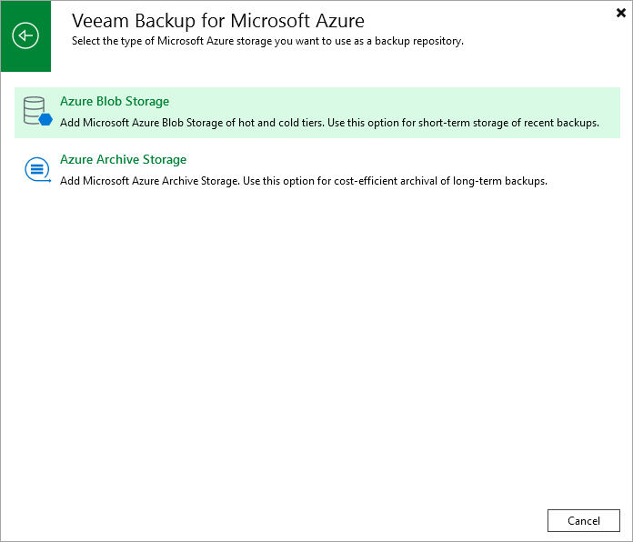

In this article

To launch the Add External Repository wizard, do the following:

1. In the Veeam Backup & Replication console, open the Backup Infrastructure view.
2. Navigate to External Repositories and click Add Repository on the ribbon.

Alternatively, you can right-click the External Repositories node and select Add.

1. In the Add External Repository window:

1. [Applies only if you have several cloud plug-ins installed] Click Veeam Backup for Microsoft Azure.
2. Choose whether you want to create a standard or an archive repository:

* Select the Azure Blob Storage option if you want to create a repository of the Hot or Cool access tier. In this case, the repository will be assigned the access tier selected in Microsoft Azure for the storage account that you will specify at [step 3](repository_console_storage_account.md).
* Select the Azure Archive Storage option if you want to create a repository of the Archive access tier. Consider that to restore data from an archive repository, you first need to retrieve data from it. To learn how to retrieve data, see [Retrieving Data from Archive](retriving_archived_data.md).

Page updated 8/20/2025

Page content applies to build 8.0.1.202
