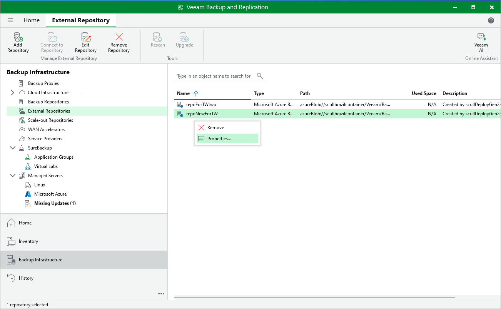
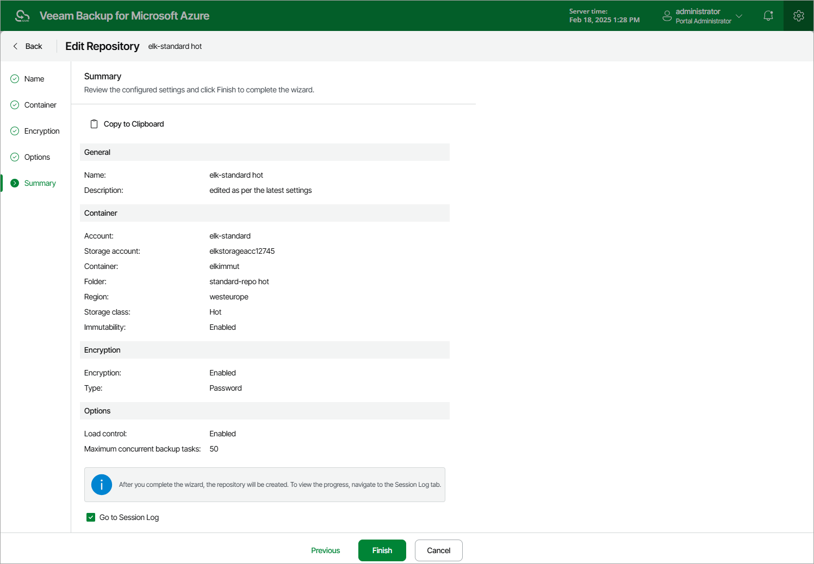

# Editing Repository Settings

The settings that you can modify for a repository depend on whether the repository has been added to the backup infrastructure using the Veeam Backup & Replication console or the Veeam Backup for Microsoft Azure Web UI.

Editing Backup Repository Settings Using Veeam Backup & Replication Console

For each standard repository, you can modify settings configured while adding the repository to the backup infrastructure:

1. In the Veeam Backup & Replication console, open the Backup Infrastructure view.
2. Navigate to External Repositories.
3. Select the necessary repository and click Edit Repository on the ribbon.

Alternatively, you can right-click the repository and select Properties.

1. Complete the Edit External Repository wizard:

1. To specify a new name and description for the repository, follow the instructions provided in section [Creating New Repositories](repository_console_appliance.md) (step 2).
2. To change the credentials of the Microsoft Azure storage account and the gateway server used to access the repository, follow the instructions provided in section [Creating New Repositories](repository_console_storage_account.md) (step 3).
3. To enable encryption or change the encryption settings of the repository, follow the instructions provided in section [Creating New Repositories](repository_console_encryption.md) (step 6).

|  |
| --- |
| Important |
| If you change the encryption settings of a standard backup repository using the Veeam Backup & Replication console, Veeam Backup & Replication will not propagate these settings to the backup appliance automatically. Consider updating the settings manually as described in section [Editing Repository Settings Using Veeam Backup for Microsoft Azure Web UI](#editing_repo_settings_ui). |

1. At the Apply step of the wizard, wait for the changes to be applied and click Next.
2. At the Summary step of the wizard, review summary information and click Finish.

Editing Repository Settings Using Veeam Backup for Microsoft Azure Web UI

For each repository, you can modify settings configured while adding the repository to Veeam Backup for Microsoft Azure:

1. Switch to the Configuration page.
2. Navigate to Repositories.
3. Select the repository and click Edit.
4. Complete the Edit Repository wizard.

1. To provide a new name and description for the repository, follow the instructions provided in section [Adding Backup Repositories Using Web UI](repository_ui_name.md) (step 2) or in section [Adding Storage Vaults Using Web UI](repository_vdc_ui_name.md) (step 2).
2. [Applies only to backup repositories] To change the service account whose permissions Veeam Backup for Microsoft Azure uses to access the repository, follow the instructions provided in section [Adding Backup Repositories Using Web UI](repository_ui_settings.md#Account) (step 3).
3. [Applies only to repositories managed by another backup appliance] To change the owner of the repository, switch to the Container step and click Next. Then, follow the instructions provided in section [Adding Backup Repositories Using Web UI](repository_ui_owner.md) (step 3).
4. [Applies only to backup repositories] To enable data encryption or change the configured encryption settings, follow the instructions provided in section [Adding Backup Repositories Using Web UI](repository_ui_encryption.md) (step 4).
5. [Applies only to storage vaults] To change the password used to encrypt backed-up data, follow the instructions provided in section [Adding Storage Vaults Using Web UI](repository_vdc_ui_encryption.md) (step 4).

|  |
| --- |
| Important |
| If your backup appliance is managed by a Veeam Backup & Replication server and you change the encryption settings of a backup repository using the Veeam Backup for Microsoft Azure Web UI, Veeam Backup for Microsoft Azure will not propagate these settings to the Veeam Backup & Replication server automatically. Consider updating the settings manually as described in section [Editing Repository Settings Using Veeam Backup & Replication Console](#editing_repo_settings). |

1. [Applies only to backup repositories] To change the configured load control settings for the repository, follow the instructions provided in section [Adding Backup Repositories Using Web UI](repository_ui_load.md) (step 5).
2. [Applies only to storage vaults] To change the configured load control and storage settings for the vault, follow the instructions provided in section [Adding Storage Vaults Using Web UI](repository_vdc_ui_load.md) (step 5).
3. At the Summary step of the wizard, review summary information, choose whether you want to proceed to the [Session Log page](session_statistics.md) to track the progress of modifying the repository settings, and click Finish to confirm the changes.

