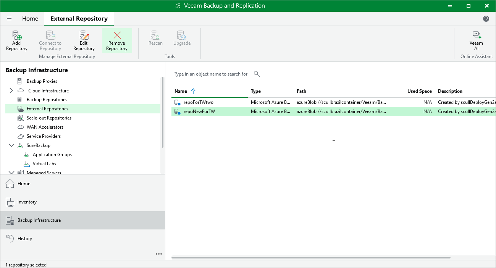
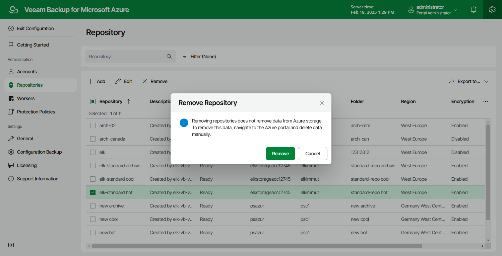

# Removing Repositories

The consequences of actions performed with a repository depend on whether the repository has been added to the backup infrastructure using the Veeam Backup & Replication console or the Veeam Backup for Microsoft Azure Web UI.

Removing Backup Repositories Using Veeam Backup & Replication Console

Veeam Plug-in for Microsoft Azure allows you to permanently remove repositories from the backup infrastructure:

1. In the Veeam Backup & Replication console, open the Backup Infrastructure view.
2. Navigate to External Repositories.
3. Select the necessary repository and click Remove Repository on the ribbon.

Alternatively, you can right-click the repository and select Remove.

Note that the repository will not be removed from the backup appliance. To learn how to remove repositories from backup appliances, see [Removing Repositories Using Veeam Backup for Microsoft Azure Web UI](#remove_repo_from_web_ui).

Removing Repositories Using Veeam Backup for Microsoft Azure Web UI

The Veeam Backup for Microsoft Azure Web UI allows you to permanently remove repositories if you no longer need them. When you remove a repository, Veeam Backup for Microsoft Azure unassigns the repository from the folder in the target blob container so that the folder is no longer used as a repository.

|  |
| --- |
| Note |
| Even though the folder is no longer used as a repository, Veeam Backup for Microsoft Azure preserves all backups previously stored in the repository and keeps these backups in Microsoft Azure. You can assign the folder to a new backup repository so that Veeam Backup for Microsoft Azure imports the backed-up data to the configuration database. In this case, you will be able to perform all disaster recovery operations described in section [Performing Restore](performing_restore.md).  If you no longer need the backed-up data, you can remove it as described in section [Managing Backed-Up Data](managing_backups.md). |

To remove a repository, do the following:

1. Switch to the Configuration page.
2. Navigate to Repositories.
3. Select the repository and click Remove.

|  |
| --- |
| Important |
| Consider the following:   * You cannot remove a repository that is used by any backup policy or by a scheduled configuration backup. [Modify the settings of all the related policies](backup.md) to remove references to the repository — and then try removing the repository again. * When you remove a backup repository from a backup appliance managed by a Veeam Backup & Replication server, this repository will not be removed from the Veeam Backup & Replication console automatically. In this case, you need to [remove the repository manually](#removing_repository_console). |

