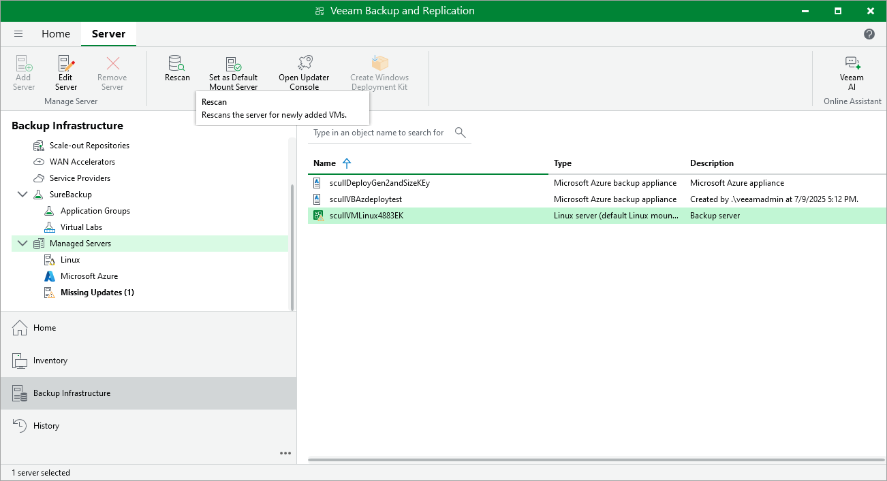

In this article

Veeam Backup & Replication periodically rescans standard repositories for newly created restore points and metadata — the results of every rescan session are displayed in the History view under the System node. A rescan operation is launched automatically every 24 hours or in the following cases:

* After you add a repository to the backup infrastructure.
* After a backup chain is modified in the repository (for example, if a restore point is added or deleted from the chain).

However, you can perform a rescan operation for a repository manually:

1. In the Veeam Backup & Replication console, open the Backup Infrastructure view.
2. Navigate to External Repositories.
3. Select the necessary repository and click Rescan on the ribbon.

Alternatively, you can right-click the repository and select Rescan.

If multiple repositories are present in the backup infrastructure, you can perform the rescan operation for all repositories simultaneously. To do that, right-click the External Repositories node and select Rescan.

|  |
| --- |
| Note |
| Veeam Backup & Replication does not rescan backups of virtual network configurations stored in repositories. |

Page updated 7/10/2025

Page content applies to build 8.0.1.202
