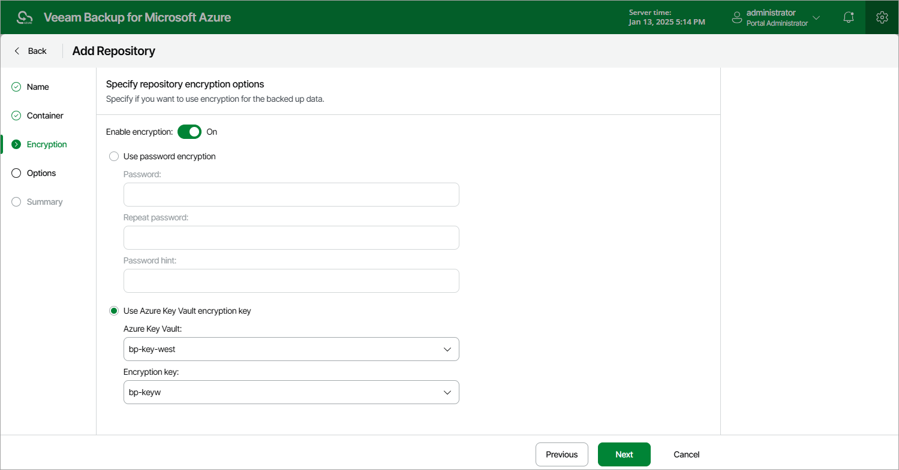

In this article

At the Encryption step of the wizard, choose whether you want to encrypt backups stored in the selected blob container.

|  |
| --- |
| Note |
| If you have selected an existing folder at the Container step of the wizard, you cannot change the encryption settings while adding the repository. If encryption is enabled for this folder at the repository level, you must provide the currently used password or an encryption key to let Veeam Backup for Microsoft Azure access this folder and add it as a backup repository. You will be able to edit the repository settings later as described in section [Editing Repository Settings](repository_edit.md). |

To enable encryption for the backup repository, do the following:

1. Click Edit Encryption Settings.
2. In the Encryption settings window, set the Enable encryption toggle to On.

|  |
| --- |
| Important |
| After you create a repository with encryption enabled, you will not be able to disable encryption for this repository. However, you will still be able to change the encryption settings as described in section [Editing Repository Settings](repository_edit.md). |

1. Choose whether you want to use a password or an Azure Key Vault cryptographic key to encrypt the backed-up data.

* To use password encryption, select the Use password encryption option and specify a password that will be used to encrypt data.
* To encrypt data using an Azure Key Vault cryptographic key, select the Use Azure Key Vault encryption key option, choose an Azure Key Vault where the cryptographic key is stored, and then choose the necessary key.

For an Azure vault to be displayed in the list of available vaults, it must be created in Microsoft Azure as described in [Microsoft Docs](https://docs.microsoft.com/en-us/azure/key-vault/general/quick-create-portal#create-a-vault). For a cryptographic key to be displayed in the list of available encryption keys, it must be created in Microsoft Azure as described in [Microsoft Docs](https://docs.microsoft.com/en-us/azure/key-vault/secrets/quick-create-portal#add-a-secret-to-key-vault).

|  |
| --- |
| Important |
| If you want to use an Azure Key Vault cryptographic key for encryption at the repository level, consider the following:   * Do not disable cryptographic keys specified in the repository settings. Otherwise, Veeam Backup for Microsoft Azure will not be able to encrypt data, and backup policies that store backups in these repositories will fail to complete successfully. * Do not delete cryptographic keys specified in the repository settings. Otherwise, Veeam Backup for Microsoft Azure will not be able to decrypt data stored in these repositories.   If a cryptographic key is scheduled for deletion, it will acquire the Pending deletion state. In this case, Veeam Backup for Microsoft Azure will raise a warning, and, during the following 7 days, you must either change the encryption settings for the backup repository in Veeam Backup for Microsoft Azure or cancel the key deletion. |

Page updated 8/19/2025

Page content applies to build 8.0.1.202
