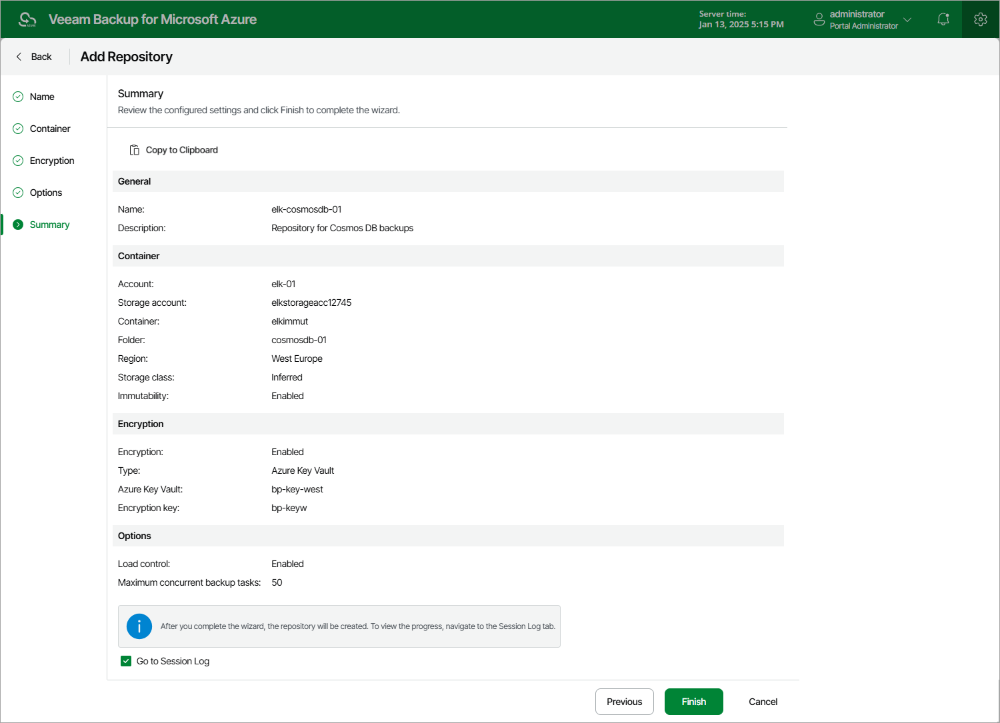

In this article

At the Summary step of the wizard, review summary information, choose whether you want to proceed to the [Session Log page](session_statistics.md) to track the progress of repository creation, and click Finish.

As soon as you click Finish, Veeam Backup for Microsoft Azure will check whether any restore points were previously stored in this repository — and will automatically import all the detected restore points to the configuration database. Veeam Backup for Microsoft Azure will then periodically rescan repositories for newly created restore points and metadata. For more information, see [Rescanning Repositories](repository_rescan.md).

|  |
| --- |
| Tip |
| Veeam Backup for Microsoft Azure does not rescan backups of virtual network configurations stored in the repositories. If you accidentally delete a virtual network configuration backup from the database, you can perform an import operation manually to restore this backup using its copy in the repository, as described in section [Importing Virtual Network Configuration Data](importing_vnet_backups.md). |

Page updated 8/19/2025

Page content applies to build 8.0.1.202
