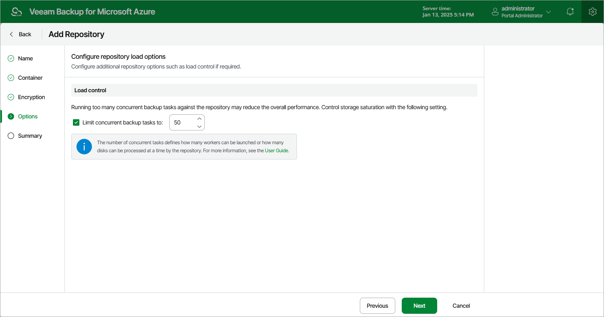

# Step 5. Configure Load Control Settings

While backing up Azure resources, Veeam Backup for Microsoft Azure launches worker instances responsible for processing and transferring backed-up data to backup repositories. When a backup policy addresses a backup repository, worker instances establish connections with the repository to retrieve data. To learn how Veeam Backup for Microsoft Azure performs backup operations, see [Overview](overview.md).

Too many connections to a repository at a time may cause performance issues due to [Microsoft Azure limitations](https://learn.microsoft.com/en-us/azure/storage/common/scalability-targets-standard-account#scale-targets-for-standard-storage-accounts) for storage accounts. To avoid these issues, you can limit the number of concurrent connections to the repository. The number of concurrent tasks defines how many worker instances can be launched to process Azure resources whose backups will be stored in this repository.

To limit the number of concurrent connections, select the Limit concurrent backup tasks to check box and specify the maximum number of tasks that can be simultaneously processed when addressing the repository.

|  |
| --- |
| Tip |
| If the specified number of concurrent tasks is less than the maximum number of worker instances that Veeam Backup for Microsoft Azure is allowed to launch and use simultaneously to process Azure resources during backup operations, Veeam Backup for Microsoft Azure will only launch as many worker instances as many concurrent tasks are specified. To learn how to set the maximum allowed number of worker instances, see [Adding Worker Profiles](worker_profile_selection.md). |

