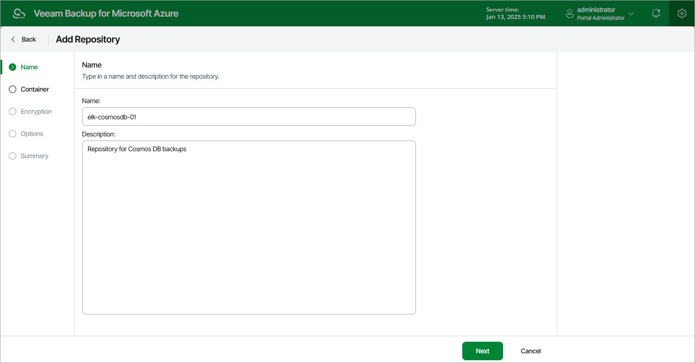

# Step 2. Specify Repository Name

At the Name step of the wizard, enter a name for the new backup repository and provide a description for future reference. The maximum length of the name is 125 characters. The following characters are not supported: \* : / \ ? " < > | ! @ # $ % ^ & .

