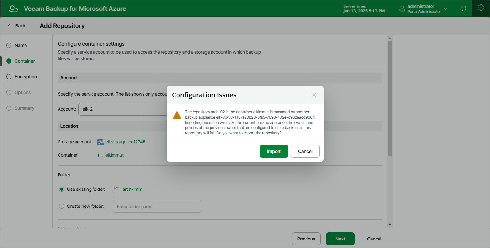

# Repository Ownership Alert

To prevent the same backup repository from being used simultaneously on different backup appliances, Veeam Backup for Microsoft Azure verifies whether the backup repository is managed by any backup appliance when you add an existing folder as a target backup repository. Retention sessions running on different appliances may corrupt backup files stored in this repository, which may result in unpredictable data loss.

If the backup repository is already connected to any backup appliance, Veeam Backup for Microsoft Azure will display a warning notifying that the backup repository has a different backup appliance owner. To allow Veeam Backup for Microsoft Azure to take ownership of this repository, click Import. If you do not want to import the repository to the current backup appliance, click Cancel and choose another folder as a target backup repository.

|  |
| --- |
| Important |
| Consider the following:   * Veeam Backup for Microsoft Azure verifies the backup appliance owner only for those backup repositories that were added to Veeam Backup for Microsoft Azure version 7.0 or later. * As soon as you import the backup repository to the current backup appliance, the backup policies configured on the previous backup appliance will start failing. * As soon as you import the backup repository to the current backup appliance, Veeam Backup for Microsoft Azure launches a worker instance in an Azure region in which the repository resides. * Make sure to remove the repository from the previous backup appliance to prevent possible data corruption. |

