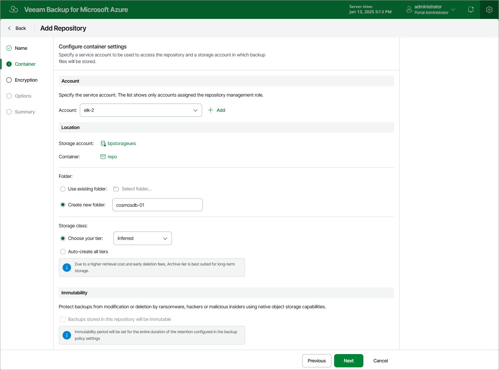

In this article

At the Container step of the wizard, select a service account that will be used to access the created repository, specify a location where the repository will be created, and configure immutability settings for the repository.

Specifying Service Account

In the Account section, select a service account whose permissions Veeam Backup for Microsoft Azure will use to create the new repository in the target Azure blob container and further to access the repository when performing data protection and recovery tasks. The specified service account must be assigned permissions listed in section [Repository Permissions](repository_permissions.md).

For an account to be displayed in the Account list, it must be added to Veeam Backup for Microsoft Azure and assigned the Repository Management role as described in section [Adding Service Accounts](service_account_add.md). If you have not added the necessary account to Veeam Backup for Microsoft Azure beforehand, you can do it without closing the Add Repository wizard. To do that, click Add and complete the Add Account wizard.

Choosing Repository Location

In the Location section, do the following:

1. Specify a storage account where the target blob container resides. To do that, click Specify storage account and select the necessary storage account in the Select storage account window. Veeam Backup for Microsoft Azure will use the account to access the backup repository.

For a storage account to be displayed in the list of available accounts, it must be created in the Microsoft Azure portal as described in [Microsoft Docs](https://docs.microsoft.com/en-us/azure/storage/common/storage-account-create?tabs=azure-portal#create-a-storage-account).

|  |
| --- |
| Important |
| Consider the following:   * Veeam Backup for Microsoft Azure does not support creation of backup repositories in storage accounts with the [blob soft delete](https://docs.microsoft.com/en-us/azure/storage/blobs/soft-delete-blob-overview#recommended-data-protection-configuration) option enabled. * Due to Microsoft Azure limitations, Veeam Backup for Microsoft Azure does not support creation of archive repositories in storage accounts with the [Zone-redundant storage](https://learn.microsoft.com/en-us/azure/storage/common/storage-redundancy#zone-redundant-storage) (ZRS), [Geo-zone-redundant storage](https://learn.microsoft.com/en-us/azure/storage/common/storage-redundancy#geo-zone-redundant-storage) (GZRS) or [Read-access geo-zone-redundant storage](https://learn.microsoft.com/en-us/azure/storage/common/storage-redundancy#read-access-to-data-in-the-secondary-region) (RA-GZRS) redundancy option enabled. For more information, see [Microsoft Docs](https://learn.microsoft.com/en-us/azure/storage/blobs/access-tiers-overview#archive-access-tier). |

1. Choose a blob container that will be used as a target location for backups of Azure resources. To do that, click Not specified and select the necessary blob container in the Select container window.

For a container to be displayed in the Container list, it must be created for the selected storage account in the Microsoft Azure portal as described in [Microsoft Docs](https://docs.microsoft.com/en-us/azure/storage/blobs/storage-quickstart-blobs-portal#create-a-container).

1. Choose whether you want to use an existing folder inside the selected blob container or to create a new one to group backup files stored in the container.

* To create a new folder, select the Create new folder option and specify a name for the folder. The maximum length of the name is 256 characters; the slash (/) and backslash (\) characters are not supported.
* To use an existing folder, select the Use existing folder option and click Select folder. In the Select folder window, select the necessary folder and click Apply.

For a folder to be displayed in the Folder list, it must be created by any backup appliance as a repository (either existing or already removed from the backup infrastructure) in the selected blob container.

|  |
| --- |
| Important |
| If you select an existing folder for storing backup files, consider the following:   * The created backup repository will have the storage tier that has been specified when creating the folder. You cannot change the storage tier for the repository. * If encryption is enabled for the selected folder at the repository level, you must provide a password or an encryption key for this folder at [step 4](repository_ui_encryption.md). * If the selected folder already contains backups created by the Veeam backup service, Veeam Backup for Microsoft Azure will import the backup data to the configuration database. You can use this data to perform all disaster recovery operations described in section [Performing Restore](performing_restore.md).   By default, Veeam Backup for Microsoft Azure applies retention settings saved in the backup metadata to the imported backups. However, if the selected folder contains backups of resources that you plan to protect by a backup policy with the created repository specified as a backup target, Veeam Backup for Microsoft Azure will rewrite the saved retention settings and will apply to the imported backups new retention settings configured for that backup policy. |

1. [Applies only if you have selected the Create new folder option] In the Storage class section, choose whether you want to specify a tier for the repository manually, or to instruct Veeam Backup for Microsoft Azure to create 3 separate repositories of the Hot, Cool and Archive access tiers automatically.

If you select the Choose your tier option, you must specify the access tier that will be used to manage the cost of storing backed-up data.

* Select the Hot tier if you plan to access the backed-up data frequently.
* Select the Cool tier if you plan to store the backed-up data for at least 30 days and do not plan to access it frequently.
* Select the Archive tier if you plan to store the backed-up data for at least 180 days.

Note that to restore data from an archive, you will first need to retrieve data from it. To learn how to retrieve the data, see [Retrieving Data from Archive](retrieving_vm_data.md).

* Select the Inferred tier if you plan to use the same access tier as specified for the storage account where the selected repository resides.

For more information on access tiers for blob data, see [Microsoft Docs](https://docs.microsoft.com/en-us/azure/storage/blobs/access-tiers-overview).

|  |
| --- |
| Important |
| If you select the Archive tier for a backup repository, consider the following:   * Veeam Backup for Microsoft Azure supports only the following storage account [data redundancy](https://docs.microsoft.com/en-us/azure/storage/common/storage-redundancy) options: locally redundant storage (LRS), geo-redundant storage (GRS), read-access geo-redundant storage (RA-GRS). * The archive tier is not available in specific Azure regions. For more information, see [Microsoft Docs](https://azure.microsoft.com/en-us/global-infrastructure/services/?products=storage). |

Reviewing Immutability Settings

Veeam Backup for Microsoft Azure allows you to protect backups stored in the repository from being lost as a result of malware, ransomware or any other malicious actions. To do that, you can create repositories with immutability enabled. For more information, see [Immutability](immutability.md).

If you plan to enable immutability settings for the created repository, make sure that the specified storage account is configured as described in [this Veeam KB article](https://www.veeam.com/kb4416).

|  |
| --- |
| Note |
| For security reasons, it is recommended that you have a dedicated Azure subscription that will manage Azure storage accounts in which immutable backup files will be stored. To do that, specify a service account associated with the necessary subscription as described in section [Specifying Service Account](#Account), and then choose an Azure storage account and Azure blob container that meet the immutability requirements. |

As soon as you select a blob container, Veeam Backup for Microsoft Azure verifies the settings configured for the storage account and blob container, and displays the following information in the Immutability section:

* If the storage account and the container meet the immutability requirements, Veeam Backup for Microsoft Azure automatically selects the Backups stored in this repository will be immutable check box. In this case, the repository will be created with immutability enabled.
* If the storage account or the container does not meet the immutability requirements, Veeam Backup for Microsoft Azure automatically clears the Backups stored in this repository will be immutable check box. In this case, the repository will be created with immutability disabled.

Page updated 10/24/2025

Page content applies to build 8.0.1.202
