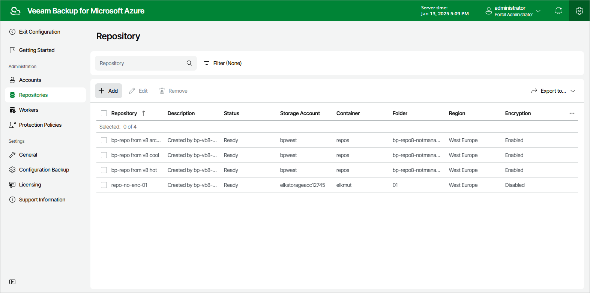

In this article

To launch the Add Repository wizard, do the following:

1. Switch to the Configuration page.
2. Navigate to Repositories.
3. Click Add.

Page updated 8/19/2025

Page content applies to build 8.0.1.202
