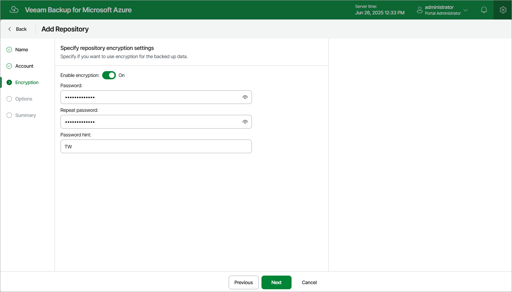

In this article

At the Encryption step of the wizard, choose whether you want to encrypt backups stored in the selected storage vault.

|  |
| --- |
| Note |
| If you have selected an existing folder at the Account step of the wizard, you cannot change the encryption settings while adding the storage vault. If encryption is enabled for this folder at the vault level, you must provide the currently used password to let Veeam Backup for Microsoft Azure access this folder and add it as a storage vault. You will be able to edit the vault settings later as described in section [Editing Repository Settings](repository_edit.md). |

To enable encryption for the vault, set the Enable encryption toggle to On and specify a password that will be used to encrypt data.

|  |
| --- |
| Important |
| After you create a storage vault with encryption enabled, you will not be able to disable encryption for this vault. |

Page updated 7/3/2025

Page content applies to build 8.0.1.202
