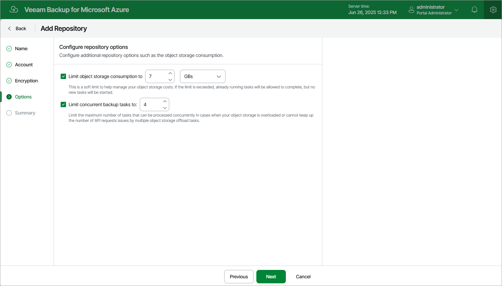

In this article

At the Options step of the wizard, you can configure additional storage vault settings such as the storage size and the maximum number of allowed connections.

Storage Consumption Settings

The cost of storing backups in storage vaults depends on how much data is actually saved to these vaults.

To optimize the cost of storing backed-up data in a storage vault, you can limit the amount of storage space that Veeam Backup for Microsoft Azure is allowed to use in the vault. To do that, select the Limit object storage consumption to check box and specify the maximum number of data storage units (in MBs, GBs or TBs) that can be used to store backups in the vault.

|  |
| --- |
| Tip |
| If the specified limit is exceeded, Veeam Backup for Microsoft Azure will complete all the backup operations that are currently addressing the storage vault, and you will get an error message that the vault has run out of free space.  To resolve the issue, either edit the vault settings to specify a higher storage consumption limit, or manually remove unnecessary backups to free some space in the vault as described in sections [Removing VM Backups and Snapshots](removing_vm_backups_and_snapshots.md), [Removing SQL Backups](removing_sql_backups.md), [Removing Cosmos DB Backups](removing_cosmos_db_backups.md) and [Removing Virtual Network Configuration Backups](removing_vnet_backups.md). |

Load Control Settings

While backing up Azure resources, Veeam Backup for Microsoft Azure launches worker instances responsible for processing and transferring backed-up data to storage vaults. When a backup policy addresses a storage vault, worker instances establish connections with the vault to retrieve data. To learn how Veeam Backup for Microsoft Azure performs backup operations, see [Overview](overview.md).

Too many connections to a storage vault at a time may cause performance issues due to [Microsoft Azure limitations](https://learn.microsoft.com/en-us/azure/storage/common/scalability-targets-standard-account#scale-targets-for-standard-storage-accounts) for storage accounts. To avoid these issues, you can limit the number of concurrent connections to the vault. The number of concurrent tasks defines how many worker instances can be launched to process Azure resources whose backups will be stored in this vault.

To limit the number of concurrent connections, select the Limit concurrent backup tasks to check box and specify the maximum number of tasks that can be simultaneously processed when addressing the vault.

|  |
| --- |
| Tip |
| If the specified number of concurrent tasks is less than the maximum number of worker instances that Veeam Backup for Microsoft Azure is allowed to launch and use simultaneously to process Azure resources during backup operations, Veeam Backup for Microsoft Azure will only launch as many worker instances as many concurrent tasks are specified. To learn how to set the maximum allowed number of worker instances, see [Adding Worker Profiles](worker_profile_selection.md). |

Page updated 7/22/2025

Page content applies to build 8.0.1.202
