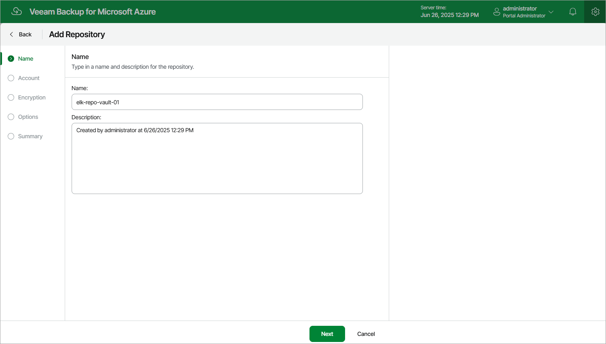

In this article

At the Name step of the wizard, use the Name and Description fields to enter a name for the new storage vault and to provide a description for future reference. The maximum length of the name is 125 characters. The following characters are not supported: \* : / \ ? " < > | ! @ # $ % ^ & .

Page updated 7/3/2025

Page content applies to build 8.0.1.202
