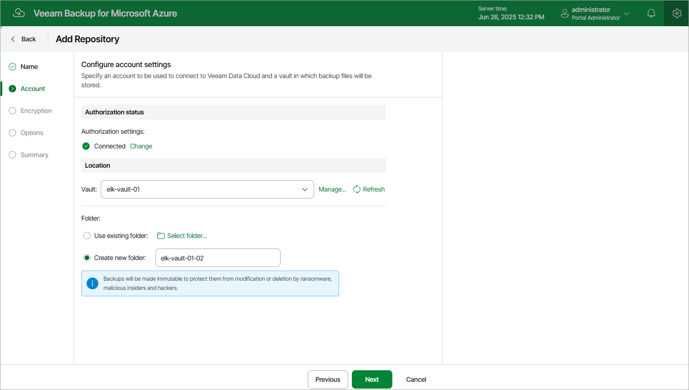

# Step 3. Configure Vault Settings

At the Account step of the wizard, connect to the Veeam Data Cloud Vault storage and specify a location where the storage vault will be created.

Connecting to Veeam Data Cloud Vault

In the Authorization status section, click Connect now. Then, enter credentials of a Veeam account that Veeam Backup for Microsoft Azure will use to create the storage vault and click Log in in the opened authentication window. Back to the Add Repository wizard, check whether any errors occurred during the authentication process.

Choosing Vault Location

In the Location section, do the following:

1. From the Vault drop-down list, select a storage vault that will be used as a target location for backups, and click Apply.

For a storage vault to be displayed in the list of available vaults, it must be created in Veeam Data Cloud Vault as described in the Veeam Data Cloud User Guide, section [Adding Storage Vaults](https://helpcenter.veeam.com/docs/vdc/userguide/vault_storage_vaults_add.html). If you have not created the necessary storage vault beforehand, you can do it without closing the Add Repository wizard. To do that, click Manage, click Configure on the Vaults page of the My Account portal, navigate to Vault and then click Add Tenant.

1. Choose whether you want to use an existing folder inside the selected storage vault or to create a new one to group backup files stored in the vault.

* To create a new folder, select the Create new folder option and specify a name for the folder. The maximum length of the name is 256 characters; the slash (/) and backslash (\) characters are not supported.
* To use an existing folder, select the Use existing folder option and click Select folder. In the Select folder window, select the necessary folder and click Apply.

For a folder to be displayed in the Folder list, it must be created in the selected storage vault.

