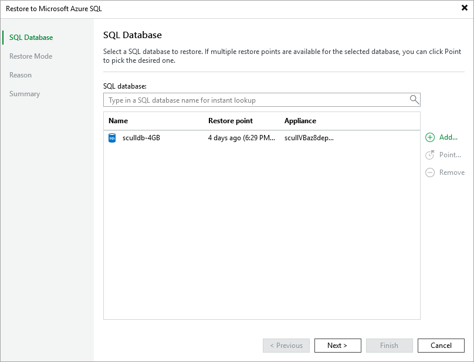

# Step 2. Select SQL Database and Restore Point

At the SQL database step of the wizard, choose a restore point that will be used to restore the selected Azure SQL database. By default, Veeam Backup & Replication uses the most recent valid restore point. However, you can restore the database data to an earlier state.

To select a restore point, do the following:

1. In the SQL database list, select the SQL database and click Point.

1. In the Restore Points window, expand the backup policy that protects the SQL database, select the necessary restore point and click OK.

To help you choose a restore point, Veeam Backup & Replication provides the following information on each available restore point:

* Job — the name of the backup policy that created the restore point and the date when the restore point was created.
* Type — the type of the restore point.
* Location — the repository where the restore point is stored.

|  |
| --- |
| Tip |
| You can use the wizard to restore multiple databases at a time. To do that, click Add, select more databases to restore and choose a restore point for each of them. |

