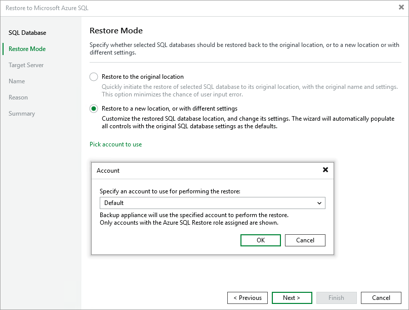

# Step 3. Choose Restore Mode

At the Restore Mode step of the wizard, do the following:

1. Choose whether you want to restore the Azure SQL database to the original or to a new location.

|  |
| --- |
| Important |
| If Veeam Backup & Replication cannot automatically detect an Azure SQL account that will be used to access the original SQL Server, the Restore to the original location option will not be available. However, you can restore the database to the original location using the Restore to a new location, or with different settings option. To do that, choose the specified option, select the necessary Azure SQL account at [step 4](restore_sql_server.md), and proceed with the wizard with the preconfigured settings. |

1. Click Pick account to use to select a service account whose permissions will be used to perform the restore operation. For more information on the required permissions, see [Service Account Permissions](service_account_permissions.md).

For a service account to be displayed in the list of available accounts, it must be added to Veeam Backup for Microsoft Azure and assigned the Azure SQL Restore operational role as described in section [Adding Service Accounts](service_account_add.md).

|  |
| --- |
| Note |
| To perform restore operations, Veeam Backup & Replication uses permissions of service accounts that belong to the tenants that contained original SQL databases. If none of the service accounts added to Veeam Backup for Microsoft Azure belong to these tenants, the Restore to the original location option will not be available. |

