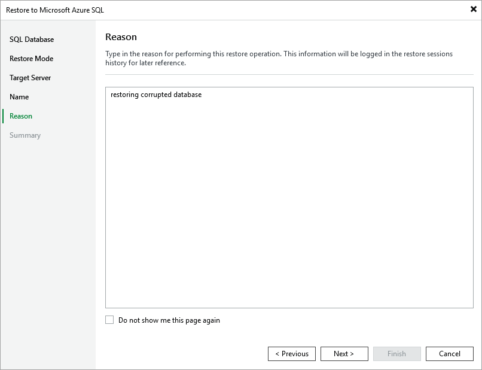

# Step 6. Specify Restore Reason

At the Reason step of the wizard, specify a reason for restoring the Azure SQL database. The information you provide will be saved in the session history and you can reference it later.

