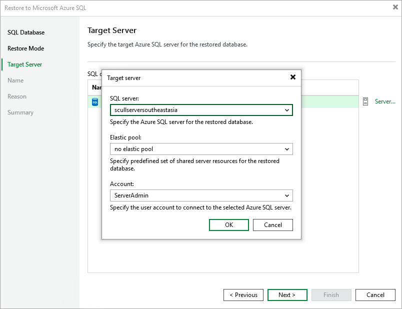

In this article

[This step applies only if you have selected the Restore to a new location, or with different settings option at the Restore Mode step of the wizard]

At the Target server step of the wizard, you can specify a target server and its settings for the restored Azure SQL database. To do that, select the database and click Server. In the Target server window, do the following:

1. From the SQL server drop-down list, select a target SQL Server or an Azure SQL Managed Instance that will host the restored database.

For a SQL Server to be displayed in the list of available servers, it must be created in Microsoft Azure as described in [Microsoft Docs](https://learn.microsoft.com/en-us/azure/azure-sql/virtual-machines/windows/create-sql-vm-portal?view=azuresql).

For an Azure SQL Managed Instance to be displayed in the list of available instances, it must be created in Microsoft Azure as described in [Microsoft Docs](https://learn.microsoft.com/en-us/azure/azure-sql/managed-instance/instance-create-quickstart?view=azuresql).

1. [Applies only if you restore databases to a SQL Server] From the Elastic pool drop-down list, select an elastic pool to which the restored database will be added.

For an elastic pool to be displayed in the list of available pools, it must be created in Microsoft Azure as described in [Microsoft Docs](https://learn.microsoft.com/en-us/azure/azure-sql/database/elastic-pool-overview?view=azuresql).

1. From the Account drop-down list, select an Azure SQL account that will be used to authenticate against the target SQL Server. Note that the specified account must be created on the target server beforehand and assigned full administrative permissions as described in [Microsoft Docs](https://learn.microsoft.com/en-us/azure/azure-sql/database/logins-create-manage?view=azuresql#create-additional-logins-and-users-having-administrative-permissions).

For an Azure SQL account to be displayed in the list of available accounts, it must be added to the Veeam Backup for Microsoft Azure appliance as described in section [Adding SMTP and Database Accounts](accounts_smtp_database_create.md).

Page updated 8/26/2025

Page content applies to build 8.0.1.202
