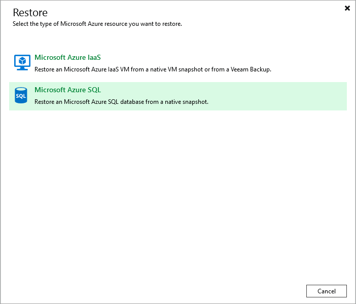

In this article

To launch the Restore to Microsoft Azure SQL wizard, do the following:

1. In the Veeam Backup & Replication console, open the Home view.
2. Navigate to Backups > External Repository.
3. In the working area, expand the backup policy that protects a SQL database you want to restore, select the necessary database and click Microsoft Azure SQL on the ribbon.

Alternatively, you can right-click the database and select Restore to Microsoft Azure SQL.

|  |
| --- |
| Tip |
| You can also launch the Restore to Microsoft Azure SQL wizard from the Home tab. To do that, click Restore and select Microsoft Azure. Then, select Microsoft Azure SQL in the Restore window. |

Page updated 8/26/2025

Page content applies to build 8.0.1.202
