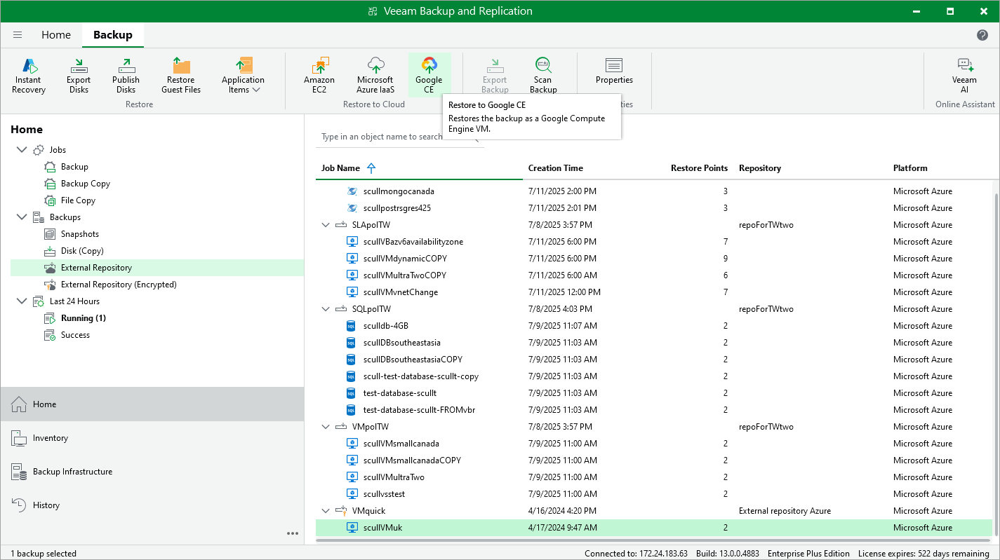

# Restoring to Google Cloud

Veeam Backup & Replication allows you to restore Azure VMs from image-level backups created with Veeam Backup for Microsoft Azure to Google Cloud as VM instances. You can restore VMs to any available restore point. For more information, see the Veeam Backup & Replication User Guide, section [Restore to Google Compute Engine](https://helpcenter.veeam.com/docs/vbr/userguide/restore_google.html?ver=13).

|  |
| --- |
| Important |
| Consider the following:   * Restore to Google Cloud cannot be performed using backups that are stored in [Veeam Data Cloud storage vaults](vdc_vaults.md). To perform this operation, use backups that are stored in standard backup repositories for which you have specified Microsoft Azure storage account credentials. To learn how to specify credentials for repositories, see sections [Creating New Repositories](repository_console_storage_account.md) and [Connecting to Existing Appliances](adding_appliance_repository.md). * Before you start the restore operation, check the limitations and prerequisites described in the Veeam Backup & Replication User Guide, section [Before You Begin](https://helpcenter.veeam.com/docs/vbr/userguide/restore_google_byb.html?ver=13). |

To restore an Azure VM to Google Cloud, do the following:

1. In the Veeam Backup & Replication console, open the Home view.
2. Navigate to Backups > External Repository.
3. Expand the backup policy that protects an Azure VM that you want to restore, select the necessary VM and click Google CE on the ribbon.

1. Complete the Restore to Google Compute Engine wizard as described in the Veeam Backup & Replication User Guide, section [Restoring to Google Compute Engine](https://helpcenter.veeam.com/docs/vbr/userguide/restore_google_account.html?ver=13).

