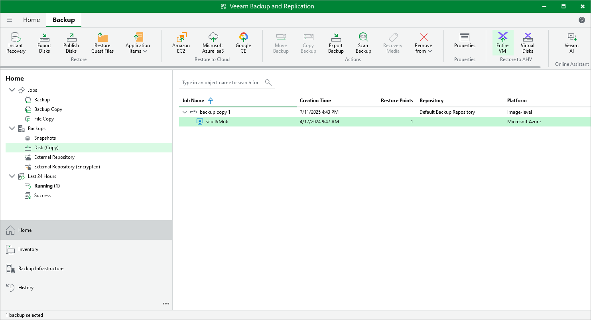

In this article

Veeam Backup & Replication allows you to restore Azure VMs from image-level backups created with Veeam Backup for Microsoft Azure to Nutanix AHV as Nutanix AHV VMs. You can restore VMs to any available restore point. For more information, see the Veeam Backup for Nutanix AHV User Guide, section [Performing Restore](https://helpcenter.veeam.com/docs/vbahv/userguide/data_recovery.html?ver=7).

|  |
| --- |
| Important |
| Restore to Nutanix AHV cannot be performed using backups that are stored in [Veeam Data Cloud storage vaults](vdc_vaults.md). To perform this operation, use backups that are stored in standard backup repositories for which you have specified Microsoft Azure storage account credentials. To learn how to specify credentials for repositories, see sections [Creating New Repositories](repository_console_storage_account.md) and [Connecting to Existing Appliances](adding_appliance_repository.md). |

Before you start the restore operation:

* Configure the backup infrastructure as described in the Veeam Backup for Nutanix AHV User Guide, section [Deployment](https://helpcenter.veeam.com/docs/vbahv/userguide/deployment.html?ver=7).

* If you restore Azure VMs from standard backups, make sure that these backups have been copied to an on-premises backup repository as described in the Veeam Backup & Replication User Guide, section [Creating Backup Copy Jobs for VMs and Physical Machines](https://helpcenter.veeam.com/docs/vbr/userguide/backup_copy_create.html?ver=13).

* If you restore Azure VMs from backups copied to the Archive access tier of a [scale-out backup repository](https://helpcenter.veeam.com/docs/vbr/userguide/archive_tier.html?ver=13), make sure to retrieve these backups from archive as described in the Veeam Backup & Replication User Guide, section [Retrieving Backup Files](https://helpcenter.veeam.com/docs/vbr/userguide/retrieval_job_launch.html?ver=13).

To restore an Azure VM to a Nutanix AHV cluster, do the following:

1. In the Veeam Backup & Replication console, open the Home view.
2. Navigate to Backups > Disk (Copy).
3. Expand the backup policy that protects an Azure VM you want to restore, select the necessary VM and click Entire VM on the ribbon.

1. Complete the Restore to Nutanix AHV wizard as described in the Veeam Backup for Nutanix AHV User Guide, section [Restoring VMs Using Veeam Backup & Replication Console](https://helpcenter.veeam.com/docs/vbahv/userguide/restore_to_ahv_select_vms.html?ver=7).

Page updated 12/23/2025

Page content applies to build 8.0.1.202
