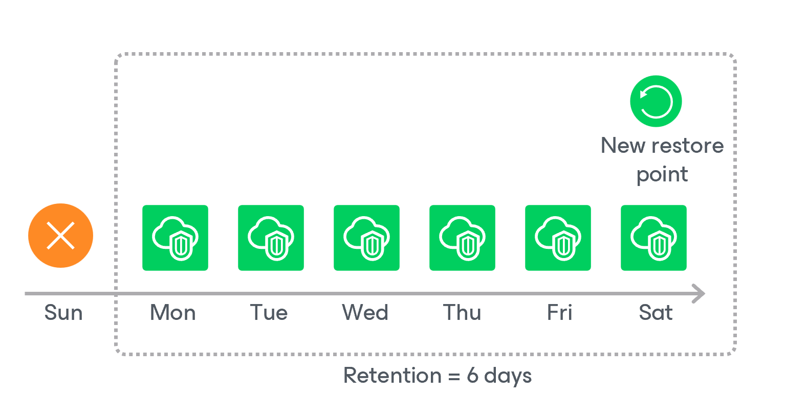

# Virtual Network Configuration Backup Retention

For virtual network configuration backups, Veeam Backup for Microsoft Azure retains restore points for the period of time specified in [backup retention settings](vnet_backup_retention.md).

During every successful backup session, Veeam Backup for Microsoft Azure creates a restore point in the configuration database. If Veeam Backup for Microsoft Azure detects that the period of time for which the restore point was stored exceeds the period specified in the retention settings, it automatically removes all restore points from the virtual network configuration backup chain. You can also remove unnecessary virtual network configuration backups manually as described in section [Removing Virtual Network Configuration Backups](removing_vnet_backups.md).

|  |
| --- |
| Note |
| Veeam Backup for Microsoft Azure applies the retention settings configured for the Virtual Network Configuration Backup policy to virtual network configuration backups stored both in the Veeam Backup for Microsoft Azure configuration database and in backup repositories — even in those repositories that are not specified in the Virtual Network Configuration Backup policy settings. |

