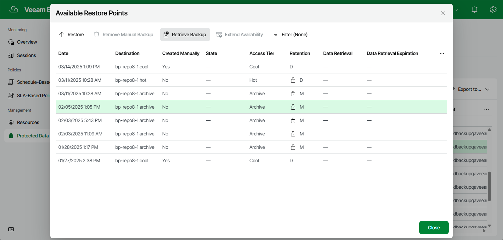
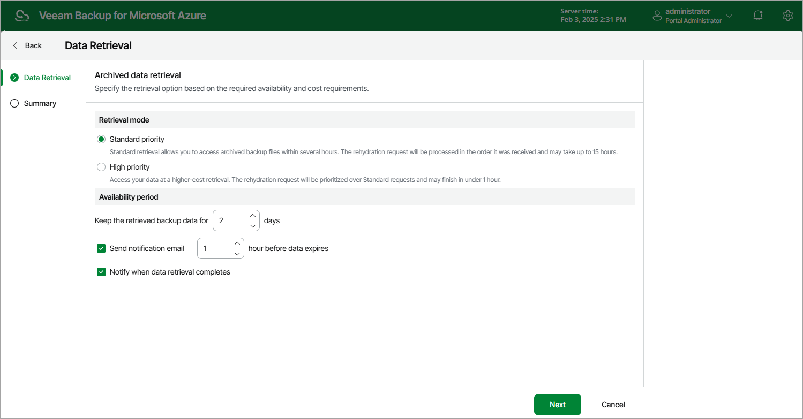
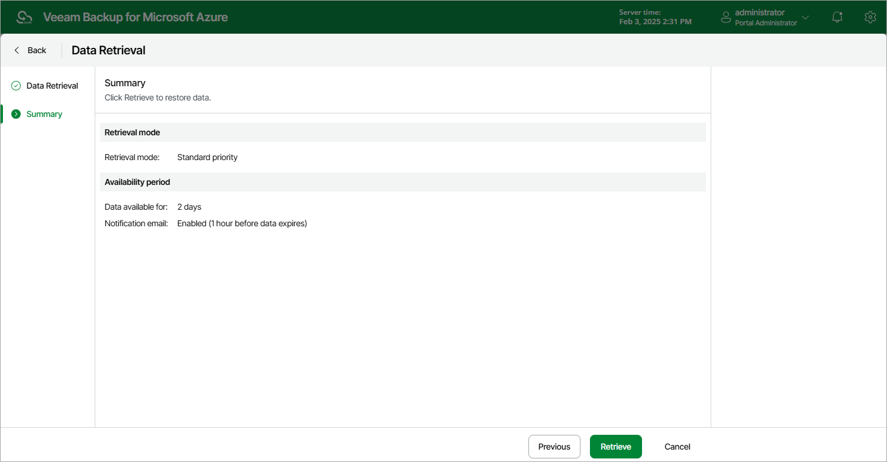

In this article

Backups stored in archive repositories are not immediately accessible. If you want to restore a Cosmos DB account from a backup that is stored in a repository of the Archive access tier, you must first retrieve the archived data. During the data retrieval process, a temporary copy of the archived data is created in an Azure blob container where the repository is located. This copy is stored in the Hot access tier for a period of time that you specify when launching the data retrieval process. If the time period expires while a restore operation is still running, Veeam Backup for Microsoft Azure automatically extends the period to keep the retrieved data available for one more hour. You can also [extend the availability period manually](#extend).

To retrieve archived data, you can launch the data retrieval process either from the [Data Retrieval wizard](#retrieval) before you begin a restore operation, or directly from the [Cosmos DB Restore wizard](cosmos_db_restore.md). When you retrieve archived data, you can choose one of the following priority options:

* Standard Priority — the default priority option. The retrieved data will be available within 15 hours.
* High Priority — the fastest but more expensive priority option. The retrieved data will be available within one hour if the size of the backup is less than 10 GB.

For more information on priority options, see [Microsoft Docs](https://docs.microsoft.com/en-us/azure/storage/blobs/archive-rehydrate-overview)

Retrieving Data Manually

To retrieve archived data of a Cosmos DB account, do the following:

1. Navigate to Protected Data > Databases > Cosmos DB.
2. Select the necessary Cosmos DB account.
3. Click the link in the Restore Points column.

1. In the Available Restore Points window, select a restore point that contains archived data you want to retrieve, and click Retrieve Backup. The Data Retrieval wizard will open.

1. At the Data Retrieval step of the wizard, specify the following settings:

1. In the Retrieval mode section, select the [retrieval option](#mode) that Veeam Backup for Microsoft Azure will use to retrieve the data.
2. In the Availability period section, specify the number of days for which you want to keep the data available for restore operations.

You will be able to [manually extend data availability](#extend) later if required.

|  |
| --- |
| Tip |
| If you want to receive an email notification when data availability period is about to expire, select the Send notification email check box and choose when you want to be notified (that is, the number of hours remaining until data expiration). |

1. At the Summary step of the Data Retrieval wizard, review configuration information and click Retrieve.

Extending Data Availability

To extend time for which you want to keep retrieved data available for restore operations:

1. Select the Cosmos DB account for which you want to extend availability of the retrieved data.

1. Click Extend Availability.

Alternatively, click the link in the Restore Points column. In the Data Retrieval window, select the restore point that contains the retrieved data, and click Extend Availability.

1. In the Extend Data Availability Period window, specify the number of days for which you want to keep the data available for restore operations, and click Extend.

Page updated 3/14/2025

Page content applies to build 8.0.1.202
