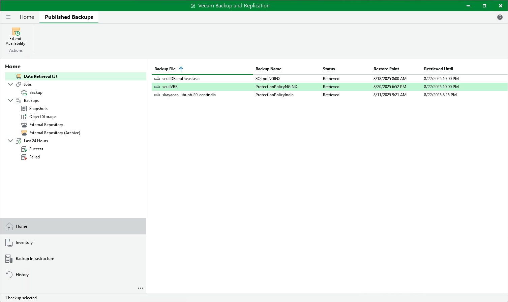
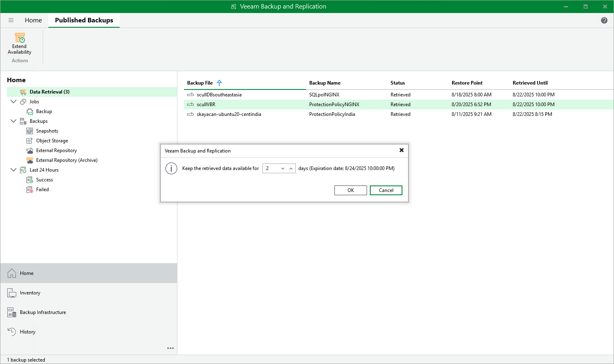

In this article

Backups stored in archive repositories are not immediately accessible. If you want to restore an Azure VM from a backup that is stored in a repository of the Archive access tier, you must first retrieve the archived data.

During the data retrieval process, a temporary copy of the archived data is created in an Azure blob container where the repository is located. This copy is stored in the Hot or Cool access tier for a period of time that you specify when launching the data retrieval process. If the time period expires while a restore operation is still running, Veeam Backup for Microsoft Azure automatically extends the period to keep the retrieved data available for one more hour. You can also extend the availability period manually.

Retrieving Data

To retrieve data from an archived restore point, complete the Retrieve Backup wizard:

1. At the Retrieval Mode step of the wizard, choose the retrieval mode that Veeam Backup & Replication will use to retrieve the archived data:

* Standard Priority — the default priority mode. If you choose this mode, the retrieved data will be available within 15 hours.
* High Priority — the faster but more expensive priority mode. If you choose this mode, the retrieved data will be available within one hour if the size of a backup file is less than 10 GB.

For more information on priority options, see [Microsoft Docs](https://docs.microsoft.com/en-us/azure/storage/blobs/archive-rehydrate-overview#rehydration-priority).

1. At the Availability Period step of the wizard, specify the number of days for which you want to keep the data available for restore operations.

The data will be available during the day when the retrieval process completes plus the specified number of days. Each day starts at 12:00 AM and ends at 11:59 PM (in your appliance time zone). For example, if the data retrieval finished at 3:00 PM on June 6, and the availability period is set to 1 day, the data will be available till 11:59 PM on June 7.

You will be able to [manually extend data availability](#extend) later if required.

|  |
| --- |
| Tip |
| If you want to receive an email notification when the data availability period is about to expire, select the Enable e-mail notifications check box and choose when you want to be notified (that is, the number of hours remaining until data expiration).  To learn how to configure global email notification settings, see the Veeam Backup & Replication User Guide, section [Configuring Global Email Notification Settings](https://helpcenter.veeam.com/docs/vbr/userguide/general_email_notifications.html?ver=13). |

1. At the Summary step of the wizard, review summary information and click Finish.

The retrieved data will be displayed in the Home view under the Data Retrieval node.

After you complete the Retrieve Backup wizard, you will be able to proceed with the Restore to Microsoft Azure wizard. However, the restore process will start only after the data is retrieved.

Extending Data Availability

To extend time for which you want to keep retrieved data available for restore operations:

1. In the Veeam Backup & Replication console, open the Home view.
2. Navigate to Data Retrieval node.
3. Select an Azure VM for which you want to extend availability of the retrieved data and click Extend Availability on the ribbon.

Alternatively, you can right-click the VM and click Extend availability.

1. In the opened window, specify the number of days for which you want to keep the data available for restore operations, and click OK.

Page updated 8/25/2025

Page content applies to build 8.0.1.202
