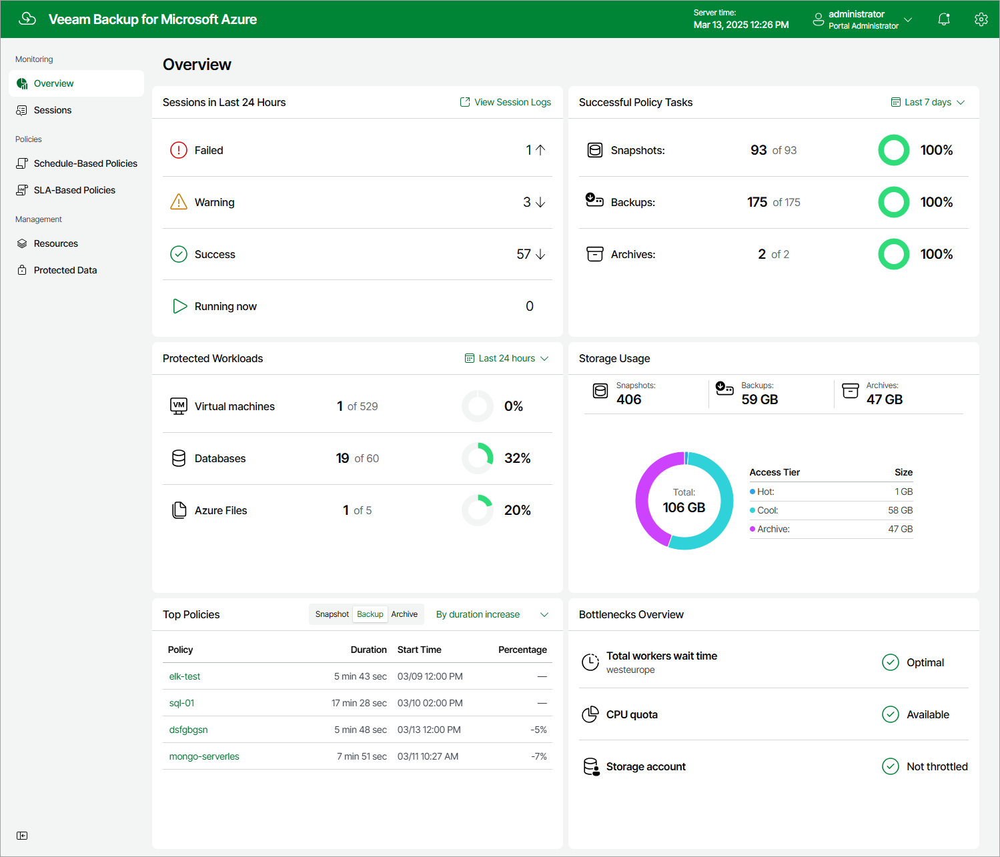

In this article

Veeam Backup for Microsoft Azure comes with an Overview dashboard that provides at-a-glance real-time overview of the protected Azure resources and allows you to estimate the overall backup performance. The dashboard includes the following widgets:

* Sessions in Last 24 Hours — displays the number of all sessions started for data protection and disaster recovery operations (including system sessions) that completed successfully during the past 24 hours, the number of sessions that completed with warnings, the number of sessions that completed with errors, and the number of sessions that are currently running.

To get more information on the sessions, click either View Session Logs or any of the widget rows. In the latter case, the Session Log tab will show only those sessions that have the same status as that clicked in the widget.

For more information on the Session Log tab, see [Viewing Session Statistics](session_statistics.md).

* Successful Policy Tasks — displays the number of snapshots, backups and archived backups successfully created by backup policies during a specific time period (the past 24 hours by default), and the number of attempts that were made to create these restore points.

To specify the time period, click the link next to the Schedule icon. To get more information on the created snapshots, backups or archived backups, click any of the widget rows. In the latter case, the Session Log tab will show only those sessions during which Veeam Backup for Microsoft Azure created the same items as that clicked in the widget.

For more information on the Session Log tab, see [Viewing Session Statistics](session_statistics.md).

* Top Policies — shows top 8 backup policies for fluctuations in execution time (including retries). For each policy, the widget calculates the growth rate to detect whether it took less or more time for the policy to complete in comparison with the previous policy run.
* Protected Workloads — displays the number of available Azure resources that got protected by Veeam Backup for Microsoft Azure during a specific time period (the past 24 hours by default).

To specify the time period, click the link next to the Schedule icon. To get more information on the protected resources, click any of the widget rows.

For more information on the available resources, their properties and the actions you can perform for the resources, see [Viewing Available Resources](viewing_resources.md).

* Storage Usage — displays the amount of storage space that is currently consumed by backups and archived backups created by Veeam Backup for Microsoft Azure in blob containers, and the number of snapshots created for the protected resources. The widget also calculates the ratio of the total amount of storage space used in the Standard Storage class to the total amount of storage space used in the Cool, Hot and Archive access tiers.
* Bottlenecks Overview — is designed to help you avoid possible backup bottlenecks.

The widget analyzes the total amount of time waited to launch worker instances during data protection operations in different Azure regions, and displays the most problematic region (if any).

The widget also analyzes the amount of CPU quota across all regions to detect whether the quota has already been reached in any of the regions, and whether Veeam Backup for Microsoft Azure failed to launch a worker instance in that region during a backup or restore process. For more information on VM sizes of Azure VMs that operate as worker instances, see [Managing Worker Instances](worker_profiles.md).

The widget also analyzes the number of management operations performed in Azure storage accounts where Veeam Backup for Microsoft Azure writes data to repositories, and displays a warning if the storage throttling limit for any of these accounts has been breached.

To learn how to resolve a bottleneck, click the '?' icon in the widget row.

Page updated 8/20/2025

Page content applies to build 8.0.1.202
