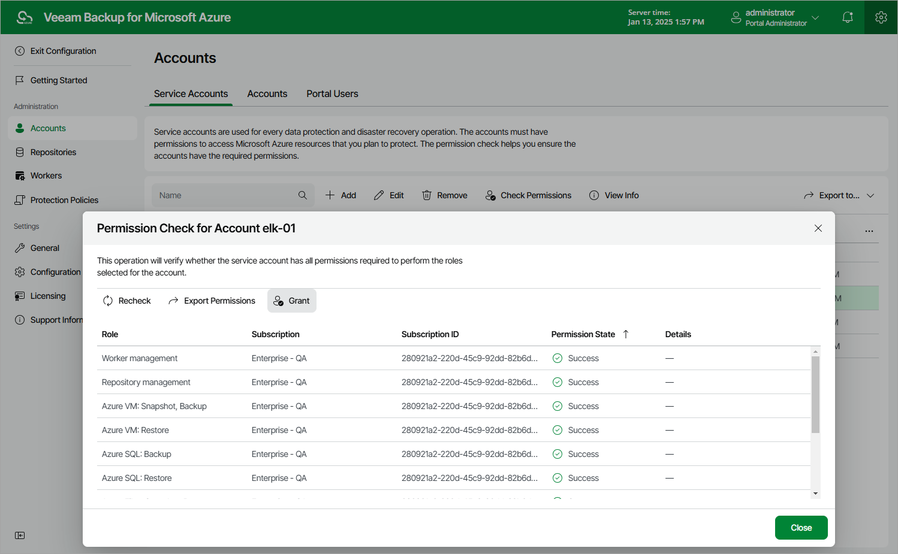

In this article

For each service account, you can check whether the account has all the permissions required to access Azure resources that you want to protect:

1. Switch to the Configuration page.
2. Navigate to Accounts > Service Accounts.
3. Select the service account and click Check Permissions.

If any of the permission checks fail, you must assign the missing permissions to the account either automatically or manually — depending on whether you chose to create the account automatically or to specify an existing account.

Granting Permissions Automatically

To grant the missing permissions automatically, do the following:

1. In the Permission Check window, click Grant.
2. In the Logon to Microsoft Azure window, click Copy Code to Clipboard and then click https://microsoft.com/devicelogin.
3. On the Microsoft Azure device authentication page, do the following:

1. Paste the code that you have copied and click Next.
2. Select a Microsoft Azure account that will be used to access the Azure CLI. The account must be assigned either the User Access Administrator or the Owner role.

1. Back to the Logon to Microsoft Azure window, check whether any errors occurred during the authentication process and click OK.

To make sure that the missing permissions have been successfully granted, click Recheck.

Assigning Permissions Manually

To assign the missing permissions manually, do the following:

1. In the Permission Check window, click Export Permissions.

Veeam Backup for Microsoft Azure will save the .JSON file with the full list of all required permissions to the default download directory on the local machine. For more information on the required permissions, see [Service Account Permissions](service_account_permissions.md).

1. Use the downloaded file to create a custom role in Microsoft Azure as described in [Microsoft Docs](https://learn.microsoft.com/en-us/azure/role-based-access-control/custom-roles-portal#start-from-json).
2. Assign the created role to the Microsoft Entra application associated with the service account as described in [Microsoft Docs](https://learn.microsoft.com/en-us/azure/role-based-access-control/role-assignments-portal?tabs=current).

To make sure that the missing permissions have been successfully granted, click Recheck.

|  |
| --- |
| Tip |
| To see the list of operations that Veeam Backup for Microsoft Azure will be able to perform using permissions of a service account, select the service account and click View Info. |

Page updated 8/27/2024

Page content applies to build 8.0.1.202
