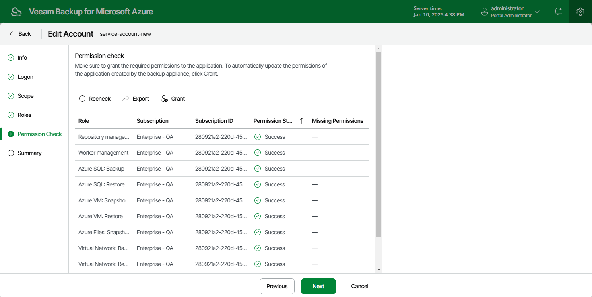

In this article

[This step applies only if you have selected the Specify existing service account option at the Type step of the wizard]

At the Permissions Check step of the wizard, Veeam Backup for Microsoft Azure will verify whether the new service account has all the permissions required to access Azure resources that you want to protect. For more information on the required permissions, see [Service Account Permissions](service_account_permissions.md).

|  |
| --- |
| Note |
| To be able to check all the permissions granted to the service account, the Microsoft Entra application that you used to create the account at [step 3](service_account_type.md) must have the "Microsoft.Authorization/roleAssignments/read" permission assigned. |

In case any of the permission checks fail, do the following:

1. Click Export. Veeam Backup for Microsoft Azure will save the .JSON file with the full list of all required permissions to the default download directory on the local machine.
2. Use the downloaded file to create a custom role in Microsoft Azure as described in [Microsoft Docs](https://learn.microsoft.com/en-us/azure/role-based-access-control/custom-roles-portal#start-from-json).
3. Assign the created role to the Microsoft Entra application associated with the new service account as described in [Microsoft Docs](https://learn.microsoft.com/en-us/azure/role-based-access-control/role-assignments-portal?tabs=current).

To make sure that the missing permissions have been successfully granted, click Recheck. Keep in mind that it may take up to 15 minutes for Veeam Backup for Microsoft Azure to detect the newly granted permissions.

Page updated 3/25/2025

Page content applies to build 8.0.1.202
