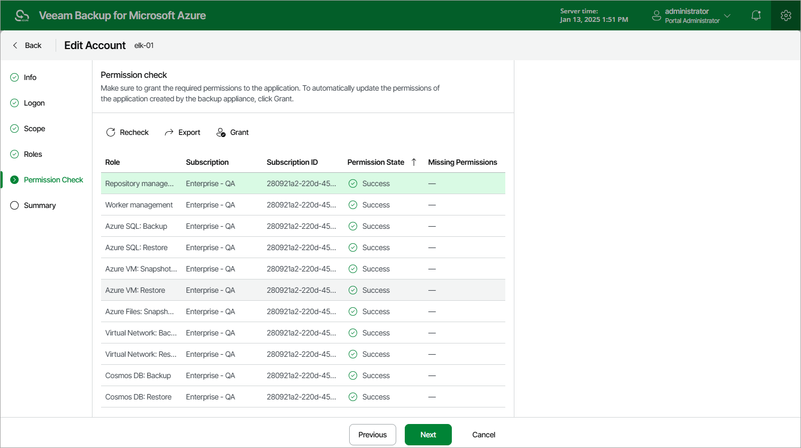

In this article

At the Permissions Check step of the wizard, you can check whether the service account has all the permissions required to access Azure resources that you want to protect. For more information on the required permissions, see [Service Account Permissions](service_account_permissions.md).

|  |
| --- |
| Note |
| To be able to check all the permissions granted to the service account, the Microsoft Entra application to which you connected at [step 3](service_account_edit_connect.md) must have the "Microsoft.Authorization/roleAssignments/read" permission assigned. |

In case any of the permission checks fail, use either of the following options:

* If the service account has been created automatically, click Grant. If you have already logged in to Azure portal at [step 3](service_account_edit_connect.md) or [step 4](service_account_edit_scope.md), Veeam Backup for Microsoft Azure will automatically grant the missing permissions to the Microsoft Entra application with which the service account is associated. If you have not logged in to Azure portal, do the following:

1. In the Logon to Microsoft Azure window, click Copy Code to Clipboard and then click https://microsoft.com/devicelogin.
2. On the Microsoft Azure device authentication page, do the following:

1. Paste the code that you have copied and click Next.
2. Select a Microsoft Azure account that will be used to access the Azure CLI. The account must be assigned either the User Access Administrator or the Owner role.

1. Back to the Logon to Microsoft Azure window, check whether any errors occurred during the authentication process and click OK.

* If the service account has been created using an existing Microsoft Entra application, do the following:

1. Click Export. Veeam Backup for Microsoft Azure will save the .JSON file with the full list of all required permissions to the default download directory on the local machine.
2. Use the downloaded file to create a custom role in Microsoft Azure as described in [Microsoft Docs](https://learn.microsoft.com/en-us/azure/role-based-access-control/custom-roles-portal#start-from-json).
3. Assign the created role to the Microsoft Entra application with which the service account is associated, as described in [Microsoft Docs](https://learn.microsoft.com/en-us/azure/role-based-access-control/role-assignments-portal?tabs=current).

To make sure that the missing permissions have been successfully granted, click Recheck.

|  |
| --- |
| Note |
| If you removed any roles at [step 5](service_account_edit_roles.md), you also need to click Grant to update the list of operations that Veeam Backup for Microsoft Azure will be able to perform using permissions of the service account. |

Page updated 8/20/2025

Page content applies to build 8.0.1.202
