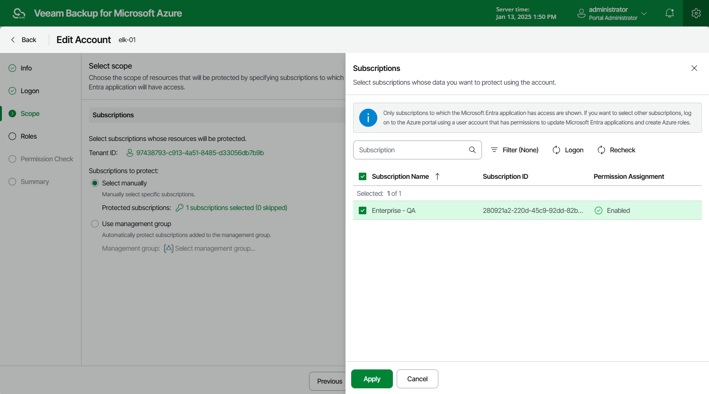

In this article

At the Scope step of the wizard, you can change the account scope — select subscriptions whose data you want to protect using permissions of the service account. To do that, click the link in the Subscriptions to protect field and choose Azure subscriptions to which the resources that you want to protect belong.

For a subscription to be displayed in the list of available subscriptions, the Microsoft Entra application with which the service account is associated must have the Contributor Azure built-in role assigned in this subscription. To learn how to assign Azure roles, see [Microsoft Docs](https://docs.microsoft.com/en-us/azure/role-based-access-control/role-assignments-portal?tabs=current).

[Applies only if the service account has been created automatically] If you have not logged in to Azure portal at [step 3](service_account_edit_connect.md), to update the list of available subscriptions, click Logon. The value displayed in the Permission Assignment column defines whether the Microsoft Azure account that you used to access the Azure CLI has the Microsoft.Authorization/\*/Write permission to create roles and role assignments for the subscription. If the Microsoft Azure account does not have this permission, grant it to the account in Microsoft Azure as described in [Microsoft Docs](https://docs.microsoft.com/en-us/azure/automation/automation-role-based-access-control). To make sure that the permission has been successfully granted, click Recheck.

Page updated 8/20/2025

Page content applies to build 8.0.1.202
