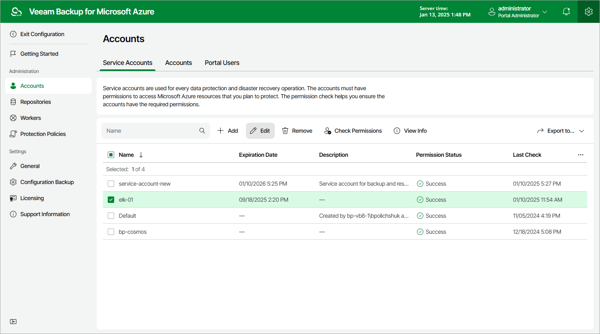

In this article

To launch the Edit Account wizard, do the following:

1. Switch to the Configuration page.
2. Navigate to Accounts > Service Accounts.
3. Select the service account and click Edit.

Page updated 6/17/2024

Page content applies to build 8.0.1.202
