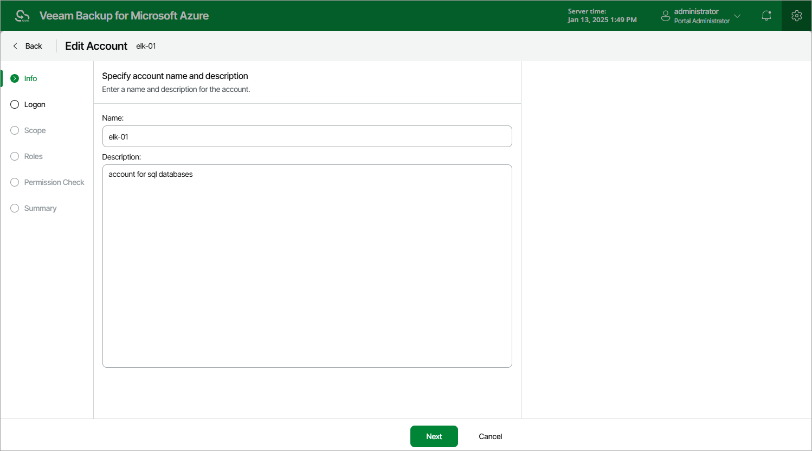

In this article

At the Info step of the wizard, use the Name and Description fields to enter a name for the new account and to provide a description for future reference.

The maximum length of the name is 255 characters. The following characters are supported: Latin letters, numeric characters, underscores and dashes. The following characters are not supported: / " ' : | < > + = ; , ? \* @ & $ .

Page updated 9/27/2024

Page content applies to build 8.0.1.202
