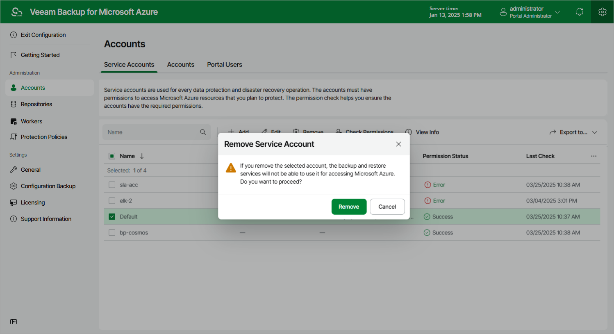

In this article

You can remove a service account from Veeam Backup for Microsoft Azure if it is no longer used to perform data protection and disaster recovery operations.

|  |
| --- |
| Important |
| You cannot remove a service account that is used to access backup repositories or is specified in the settings of any configured backup policy. |

To remove a service account, do the following:

1. Switch to the Configuration page.
2. Navigate to Accounts > Service Accounts.
3. Select the service account and click Remove.

Page updated 7/29/2025

Page content applies to build 8.0.1.202
