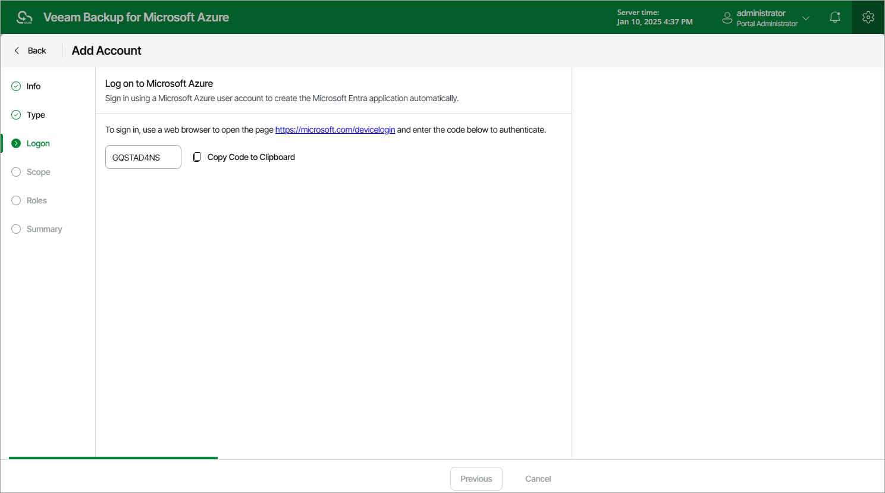
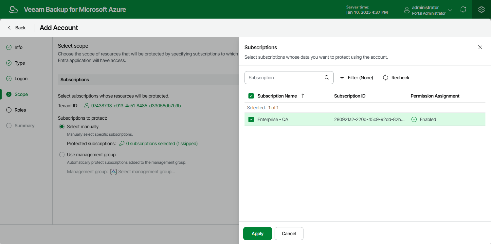

# Step 4. Select Account Scope

At the Scope step of the wizard, specify the account scope — select subscriptions whose data you want to protect.

Configuring Scope of Automatically Created Accounts

If you have selected the Create service account automatically option at the Type step of the wizard, do the following:

1. Click the link in the Tenant ID field and choose an Microsoft Entra tenant in which the Microsoft Entra application associated with the service account will be created. For a tenant to be displayed in the list of available tenants, the Microsoft Azure account that you use to access the Azure CLI must have access to this tenant.

The value displayed in the App Registration column defines whether the Microsoft Azure account that you use to access the Azure CLI has permissions to create Microsoft Entra applications in the tenant. If the Microsoft Azure account does not have these permissions, assign the Application Developer, Application Administrator or Global Administrator role to the account in Microsoft Azure as described in [Microsoft Docs](https://docs.microsoft.com/en-us/azure/active-directory/users-groups-roles/directory-assign-admin-roles#application-developer). To make sure that the role has been successfully assigned, click Recheck.

1. In the Subscriptions to protect field, use either of the following options:

* To manually specify Azure subscriptions to which the resources that you want to protect belong, click the link in the Protected subscriptions field and select all necessary Azure subscriptions. For a subscription to be displayed in the list of available subscriptions, it must be associated with the selected Microsoft Entra tenant as described in [Microsoft Docs](https://docs.microsoft.com/en-us/azure/active-directory/fundamentals/active-directory-how-subscriptions-associated-directory).

The value displayed in the Permissions State column defines whether the Microsoft Azure account that you use to access the Azure CLI has the Microsoft.Authorization/\*/Write permission to create roles and role assignments for the subscription. If the Microsoft Azure account does not have this permission, grant it to the account in Microsoft Azure as described in [Microsoft Docs](https://docs.microsoft.com/en-us/azure/automation/automation-role-based-access-control). To make sure that the permission has been successfully granted, click Recheck.

* To back up Azure resources that belong to Azure subscriptions added to a management group, select the Use management group option and specify a group that manages subscriptions to which the resources that you want to protect belong. For a group to be displayed in the list of available management groups, it must be created in the Microsoft Azure portal as described in [Microsoft Docs](https://learn.microsoft.com/en-us/azure/governance/management-groups/).

If you specify a management group as the account scope, Veeam Backup for Microsoft Azure will regularly check for new subscriptions added to the specified group and automatically update the account settings to include these subscriptions in the scope. However, this does not apply to subscriptions added to nested management groups — if the specified group contains other management groups and you want to protect resources that belong to subscriptions in these groups, it is recommended that you move the subscriptions from the nested groups to the root one.

|  |
| --- |
| Important |
| To be able to select a management group as a scope for the created service account, the Microsoft Azure account that you use to access the Azure CLI must meet the following requirements:   * It must have elevated access to manage all Azure subscriptions and management groups in Microsoft Entra ID. To learn how to elevate access for Microsoft Azure accounts, see [Microsoft Docs](https://learn.microsoft.com/en-us/azure/role-based-access-control/elevate-access-global-admin). * It must have the Owner built-in role assigned at the management group scope. To learn how to assign Azure roles, see [Azure RBAC documentation](https://docs.microsoft.com/en-us/azure/role-based-access-control/role-assignments-portal?tabs=current). |

Configuring Scope of Existing Accounts

If you have selected the Specify existing service account option at the Type step of the wizard, click the link in the Subscriptions to protect field and choose Azure subscriptions to which the resources that you want to protect belong. For a subscription to be displayed in the list of available subscriptions, the Microsoft Entra application specified at [step 3](service_account_specify_existing.md) of the wizard must have the Contributor Azure built-in role assigned in this subscription. To learn how to assign Azure roles, see [Microsoft Docs](https://docs.microsoft.com/en-us/azure/role-based-access-control/role-assignments-portal?tabs=current).

