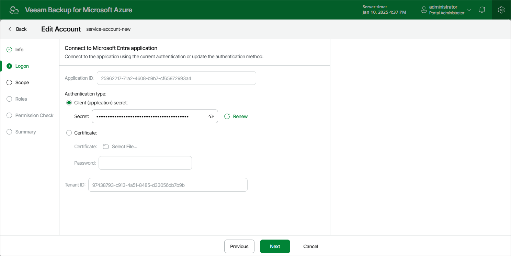

In this article

[This step applies only if you have selected the Specify existing service account option at the Type step of the wizard]

When you choose to specify an existing service account, Veeam Backup for Microsoft Azure connects to an existing [Microsoft Entra application](https://docs.microsoft.com/en-us/azure/active-directory/develop/active-directory-how-applications-are-added) that grants access to your Azure resources. For Veeam Backup for Microsoft Azure to be able to connect to the Microsoft Entra application and to protect Azure resources, the application must be created in Microsoft Azure, and have the Contributor, Key Vault Crypto User and Storage Queue Data Contributor [Azure built-in roles](https://learn.microsoft.com/en-us/azure/role-based-access-control/built-in-roles) assigned. To learn how to create Microsoft Entra applications and assign Azure roles, see [Microsoft Identity Platform](https://docs.microsoft.com/en-us/azure/active-directory/develop/howto-create-service-principal-portal#create-an-azure-active-directory-application) and [Azure RBAC documentation](https://docs.microsoft.com/en-us/azure/role-based-access-control/role-assignments-portal?tabs=current).

|  |
| --- |
| Tip |
| If you want the service account to have granular permissions, you can [create a custom role](https://learn.microsoft.com/en-us/azure/role-based-access-control/custom-roles-portal#start-from-scratch) in Microsoft Azure, [grant the necessary permissions](https://learn.microsoft.com/en-us/azure/role-based-access-control/custom-roles-portal#step-6-json) to this role, and then [assign the role](https://docs.microsoft.com/en-us/azure/role-based-access-control/role-assignments-portal?tabs=current) to the Microsoft Entra application instead of the built-in roles. For the list of required permissions, see [Service Account Permissions](service_account_permissions.md). |

At the Logon step of the wizard, specify an existing service account that grants access to your Azure resources:

1. In the Application ID field, enter the application identifier. You can find the identifier on the Overview page of your Microsoft Entra application in the Microsoft Azure portal. For more information, see [Microsoft Docs](https://docs.microsoft.com/en-us/azure/active-directory/develop/howto-create-service-principal-portal#get-values-for-signing-in).
2. Select an application authentication type:

* Select the Client (application) secret option to use a client secret created in the specified Microsoft Entra application. In the Secret field, enter the value of the secret. To learn how to create client secrets, see [Microsoft Docs](https://docs.microsoft.com/en-us/azure/active-directory/develop/howto-create-service-principal-portal#option-2-create-a-new-application-secret).

* Select the Certificate option to use a certificate uploaded to the specified Microsoft Entra application. In the Certificate field, click Select File to locate the certificate. Then, provide a password used to encrypt the certificate in the Password field. To learn how to upload certificates to Microsoft Entra applications, see [Microsoft Docs](https://docs.microsoft.com/en-us/azure/active-directory/develop/howto-create-service-principal-portal#option-1-upload-a-certificate).

|  |
| --- |
| Important |
| Veeam Backup for Microsoft Azure supports certificates only in the formats .PFX and .P12. |

1. In the Tenant ID field, enter the tenant ID of the specified Microsoft Entra application.

You can find the tenant ID on the Overview page of your Microsoft Entra application in the Microsoft Azure portal. For more information, see [Microsoft Docs](https://docs.microsoft.com/en-us/azure/active-directory/develop/howto-create-service-principal-portal#get-values-for-signing-in).

Page updated 2/12/2025

Page content applies to build 8.0.1.202
