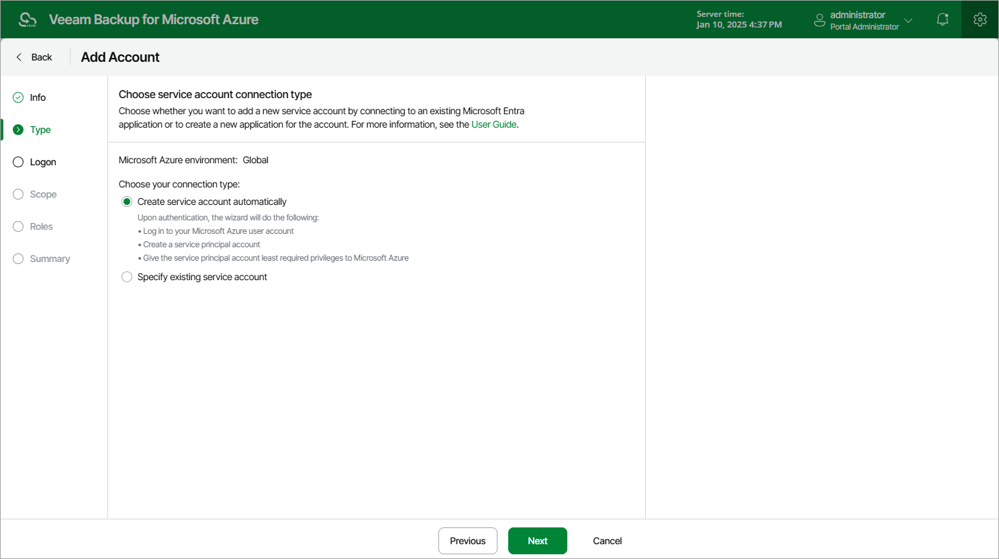

In this article

At the Type step of the wizard, choose whether you want to add a service account using an Microsoft Entra application that already exists in Microsoft Azure, or to create a new Microsoft Entra application and connect it to the service account.

Page updated 9/27/2024

Page content applies to build 8.0.1.202
