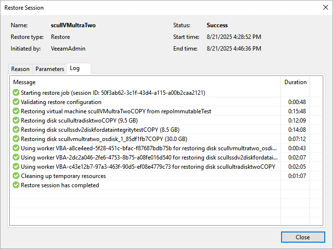
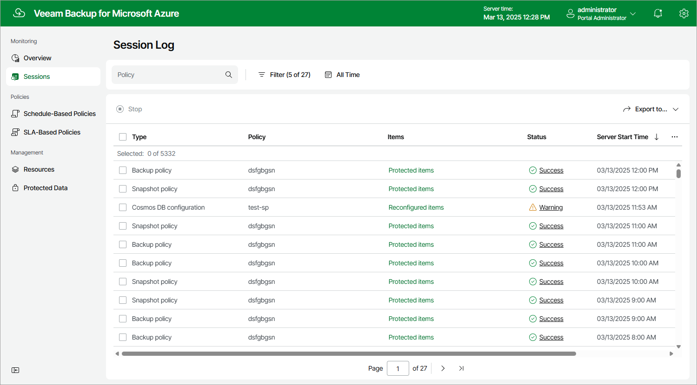

# Viewing Session Statistics

For each performed data protection or disaster recovery operation, Veeam Backup for Microsoft Azure starts a new session and stores its records in the configuration database.

Viewing Session Statistics Using Veeam Backup & Replication Console

You can track real-time statistics of all running and completed operations on the Jobs, Last 24 hours and Running nodes. For more information, see Veeam Backup & Replication User Guide, sections [Viewing Real-Time Statistics](https://helpcenter.veeam.com/docs/vbr/userguide/realtime_statistics.html?ver=13) and [Viewing Job Session Results](https://helpcenter.veeam.com/docs/vbr/userguide/session_results.html?ver=13).

Veeam Backup & Replication also allows you track statistics of data recovery operations initiated from Veeam Backup for Microsoft Azure. To do that, do either of the following:

* In the Veeam Backup & Replication console, open the Home view and navigate to Last 24 hours. In the working area, double-click the necessary restore session.

Alternatively, select the session and click Statistics on the ribbon.

* In the Veeam Backup & Replication console, open the History view and navigate to Restore. In the working area, double-click the necessary restore session.

Alternatively, select the session and click Statistics on the ribbon.

The Restore Session window will display restore session details such as the name of the VM instance whose data is being restored, the account under which the session has started, the session status and duration, information on the restore point selected for the restore operation, and the list of tasks performed during the session.

Viewing Session Statistics Using Veeam Backup for Microsoft Azure Web UI

You can track real-time statistics of all running and completed operations on the Sessions tab. To view the full list of tasks executed during an operation, click the link in the Status column. To view the full list of Azure resources processed during an operation, click the link in the Items column.

|  |
| --- |
| Tip |
| If you want to specify the time period during which Veeam Backup for Microsoft Azure will keep session records in the configuration database, follow the instructions provided in section [Configuring Global Retention Settings](configuring_global_retention.md). |

