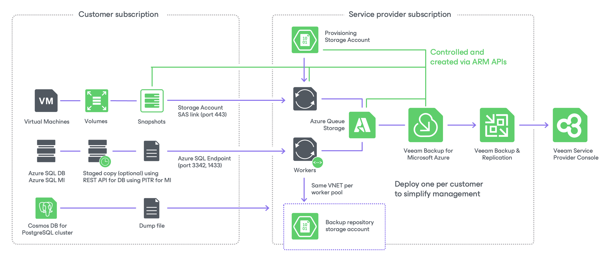

In this article

You can connect multiple backup appliances to one backup server. Normally, one backup appliance is deployed per customer, but it is possible to deploy more appliances, depending on the scale. This can be managed with [Veeam Cloud Connect](https://helpcenter.veeam.com/docs/backup/cloud/cloud_overview.html?ver=120) and the [Veeam Service Provider Console (VSPC)](https://helpcenter.veeam.com/docs/vac/provider_admin/about.html?ver=81).

Worker instances and resources will be launched in the same subscription and resource group where the backup appliance is deployed. If you need to have them in the customer subscription, deploy the appliance there, and everything will work as if deployed per individual customer. You can then connect it to Veeam Backup & Replication and Veeam Service Provider Console to fulfill service provider functions.

You can use one Veeam Backup for Microsoft Azure instance to back up more than one subscription in multiple Microsoft Entra tenants — by adding an account that has access to multiple subscriptions and tenants, or by adding multiple accounts. While this can be useful to segment resources, it is still recommended that you deploy one backup appliance per customer from a management and scaling perspective.

You can place the backup repository storage account in a subscription separate from both the customer and service provider subscriptions, as long as you have access.

|  |
| --- |
| Important |
| If your backup appliance operates in a private environment, you can protect only those Azure VMs that belong to the same tenant and subscription where this backup appliance is deployed. In this case, make sure that worker instances are also launched in the same tenant — to learn how to specify a destination for worker instances, see [Managing Worker Configurations](worker_service_account.md). |

Related Topics

* [Veeam Cloud Connect](https://helpcenter.veeam.com/docs/backup/cloud/cloud_overview.html?ver=120)
* [Veeam Service Provider Console (VSPC)](https://helpcenter.veeam.com/docs/vac/provider_admin/about.html?ver=81)

Page updated 12/9/2025

Page content applies to build 8.0.1.202
