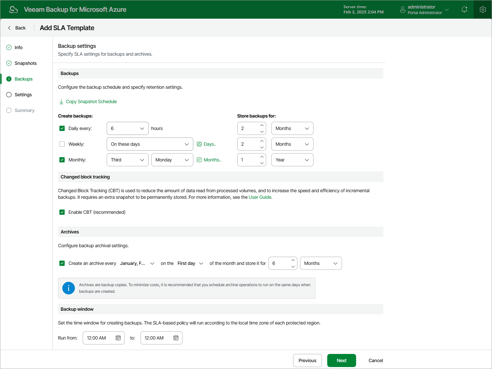

# Step 4. Configure Backup Settings

At the Backups step of the wizard, you can configure the following backup settings:

1. In the Backups section, you can instruct Veeam Backup for Microsoft Azure to create backups on a daily, weekly and monthly basis, and to keep the created backups in a backup chain for a specific number of days, months or years. If a backup is older than the specified time limit, Veeam Backup for Microsoft Azure removes the backup from the chain.

Note that if you configure a schedule but do not select the corresponding check box, Veeam Backup for Microsoft Azure will ignore the specified settings and will not create backups according to this schedule.

|  |
| --- |
| Tip |
| Veeam Backup for Microsoft Azure allows you to quickly configure a backup schedule by applying the same settings that you have configured at [step 3](sla_snapshot_settings.md). To do that, click Copy Snapshot Schedule.  However, keep in mind that snapshot schedules do not affect backup schedules, meaning that cloud-native snapshots do not participate in the process of producing image-level backups. To produce backups, Veeam Backup for Microsoft Azure takes temporary restore points but then automatically removes these points based on their own retention settings. For more information, see [Temporary Restore Points](temporary_restore_points.md). |

1. In the Changed block tracking section, you can enable the changed block tracking (CBT) mechanism that allows Veeam Backup for Microsoft Azure to reduce the amount of data read from processed Azure VMs.

Enabling CBT increases the speed and efficiency of backup operations but can incur additional costs of storing restore points in Microsoft Azure. For more information, see [SLA Templates](temporary_restore_points.md#temporary_snapshots).

1. In the Archives section, you can instruct Veeam Backup for Microsoft Azure to store backed-up data in the low-cost, long-term Archive access tier, and to keep the archived data for a specific time period.

Note that it is usually more expensive and takes more time to restore data from archived backups than from regular backups as it requires Veeam Backup for Microsoft Azure to retrieve the data from the Archive access tier. For more information, see [Retrieving Data From Archive](retrieving_vm_data.md).

1. In the Backup window section, you can instruct Veeam Backup for Microsoft Azure to create daily backups within a specific time interval if you do not want backup operations to overlap production hours.

Veeam Backup for Microsoft Azure automatically adjusts the specified backup window to the time zone of each region added to SLA-based backup policies that have this SLA template assigned. For more information, see [Data Protection Windows](snapshot_backup_window.md).

Since Veeam Backup for Microsoft Azure runs retention sessions for the related SLA-based backup policies as soon as it finalizes the backup window in all protected regions, it is recommended that you estimate how long it may take Veeam Backup for Microsoft Azure to complete these retention sessions first (the larger the infrastructure, the longer the retention sessions run) before you configure a backup window. Otherwise, Veeam Backup for Microsoft Azure may encounter throttling issues when trying to remove obsolete data from repositories.

|  |
| --- |
| Tip |
| In large environments, it is recommended that you configure separate windows for backups and snapshots to optimize backup performance and decrease the load on your infrastructure. |

When you combine multiple types of backup schedules, Veeam Backup for Microsoft Azure re-uses backups created according to a more-frequent schedule (daily or weekly) to achieve the desired SLA compliance for less-frequent schedules (weekly and monthly). For example, if you configure a daily and a monthly schedule, the first backup successfully created according to the daily schedule will be marked as both a daily and a monthly backup.

