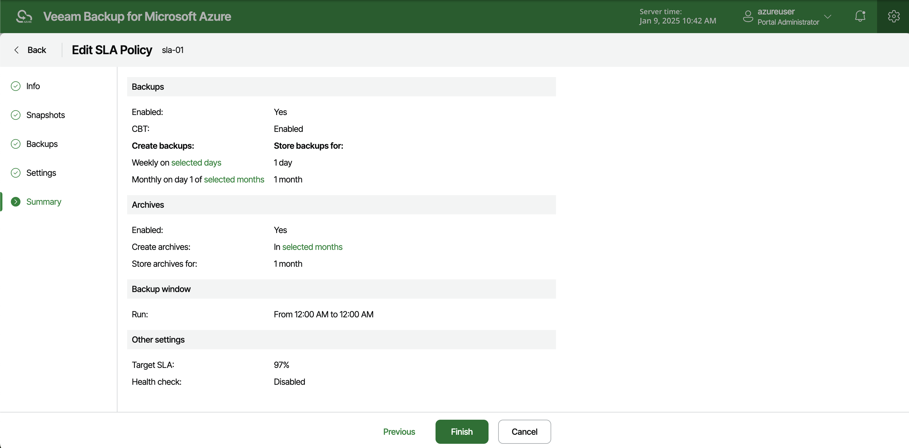

In this article

For each SLA template, you can modify settings configured while creating the template:

1. Switch to the Configuration page.
2. Navigate to Policy Templates > SLA and click Edit.
3. Complete the Edit SLA Template wizard:

1. To provide a new name and description for the template, follow the instructions provided in section [Adding SLA Templates](sla_name.md) (step 2).
2. To modify the configured snapshot settings, follow the instructions provided in section [Adding SLA Templates](sla_snapshot_settings.md) (step 3).
3. To modify the configured backup settings, follow the instructions provided in section [Adding SLA Templates](sla_backup_settings.md) (step 4).
4. To adjust the target SLA value and change the health check schedule for the template, follow the instructions provided in section [Adding SLA Templates](sla_general_settings.md) (step 5).
5. At the Summary step of the wizard, review configuration information and click Finish to confirm the changes.

|  |
| --- |
| Tip |
| After you click Finish, Veeam Backup for Microsoft Azure will update the timestamp in the Last Modified column on the SLA page, regardless of whether you have actually modified the template settings or not. If you want to simply view the configured settings without making any changes, click View Info. |

Note that modifying snapshot and backup settings for SLA templates that are already assigned to SLA-based backup policies may cause Veeam Backup for Microsoft Azure to incorrectly calculate the SLA compliance ratio for these policies on the day when this modification is made. For more information on how Veeam Backup for Microsoft Azure estimates SLA compliance, see [Viewing SLA-Based Backup Policy Details](sla_calculation.md).

Page updated 7/28/2025

Page content applies to build 8.0.1.202
