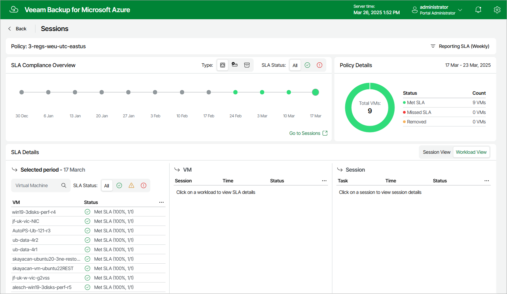

In this article

Veeam Backup for Microsoft Azure allows you to monitor the protection status of all Azure VMs included into a specific SLA-based backup policy. As soon as Veeam Backup for Microsoft Azure finalizes the data protection window in all the protected regions, the SLA details for this window are automatically added to the SLA Compliance Overview chart on the Sessions page. The chart shows whether the target SLA was met for different types of restore points (snapshots, backups and archived backups) created by the SLA-based backup policy.

The number of entries on the SLA Compliance Overview chart depends on the filtering condition (daily, weekly or monthly) that you specify when proceeding to the Sessions page. That is, if you select the Daily condition, the chart will display 14 entries (the past 14 days); if you select the Weekly condition, the chart will display 12 entries (the past 12 weeks); if you select the Monthly condition, the chart will display 12 entries (the past 12 months). To switch between the filtering conditions, click Reporting SLA.

|  |
| --- |
| Notes |
| * Since time zones of the protected regions may differ significantly, it may take Veeam Backup for Microsoft Azure up to 26 hours to add a new entry to the SLA Compliance Overview chart. * By design, Veeam Backup for Microsoft Azure does not allow you to switch between filtering conditions for archived backups — it always displays SLA details for monthly archived backups only. |

For each entry on the SLA Compliance Overview chart, you can view the following details:

* Policy Details — the number of protected Azure VMs for which the target SLA was met, the number of VMs for which the target SLA was not met, and the number of VMs that were removed from the backup scope during the time period between the currently selected and the next entry on the chart.

Note that Veeam Backup for Microsoft Azure does not estimate SLA compliance for removed VMs.

* SLA Details — the SLA compliance status of protected Azure VMs during the time period between the currently selected and the next entry on the chart.

To view session details for a protected VM, click the necessary VM in the list: the VM section will show the full list of policy sessions that were started during the selected period, as well as their status and duration. To view task details for a policy session, click the necessary session in the list: the Session section will show the full list of tasks that were executed during the selected session, as well as their status and duration.

|  |
| --- |
| Important |
| If you click a VM in the SLA Details section and some sessions are missing in the VM section, this can mean either of the following:   * Information on these sessions was removed from the configuration database according to the [global retention settings](configuring_global_retention_settings.md#sessions). * Veeam Backup for Microsoft Azure failed to start these sessions due to technical issues in the production environment. As a workaround, you can view the full list of sessions executed for the SLA-based backup policy that protects this VM — to do that, click Go to Sessions. |

Page updated 4/22/2025

Page content applies to build 8.0.1.202
