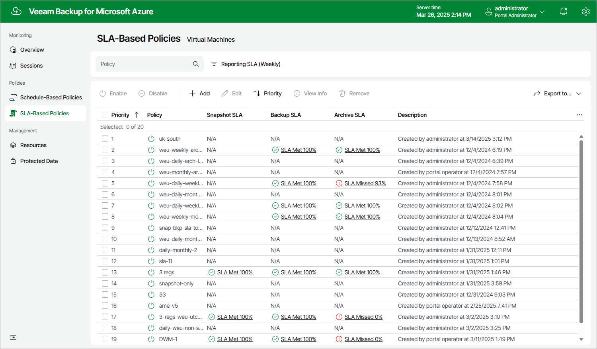

# Viewing SLA-Based Backup Policy Details

After you create an SLA-based backup policy, Veeam Backup for Microsoft Azure displays this policy on the SLA-Based tab of the Policies page. Each policy is described with the following set of properties:

* Priority — the priority of the policy.
* Policy — the name of the policy.
* Description — the reference information on the policy.
* Snapshot SLA — the most recent SLA compliance ratio calculated for all snapshots produced by the policy.
* Backup SLA — the most recent SLA compliance ratio calculated for all backups produced by the policy.
* Archive SLA — the most recent SLA compliance ratio calculated for all archived backups produced by the policy.

To see how the SLA compliance ratio has been changing over a specific period (daily, monthly or weekly) for each Azure VM protected by the policy, click the link in the Snapshot SLA, Backup SLA or Archive SLA column. For more information, see [Monitoring SLA-Based Policy Performance](sla_monitoring.md).

