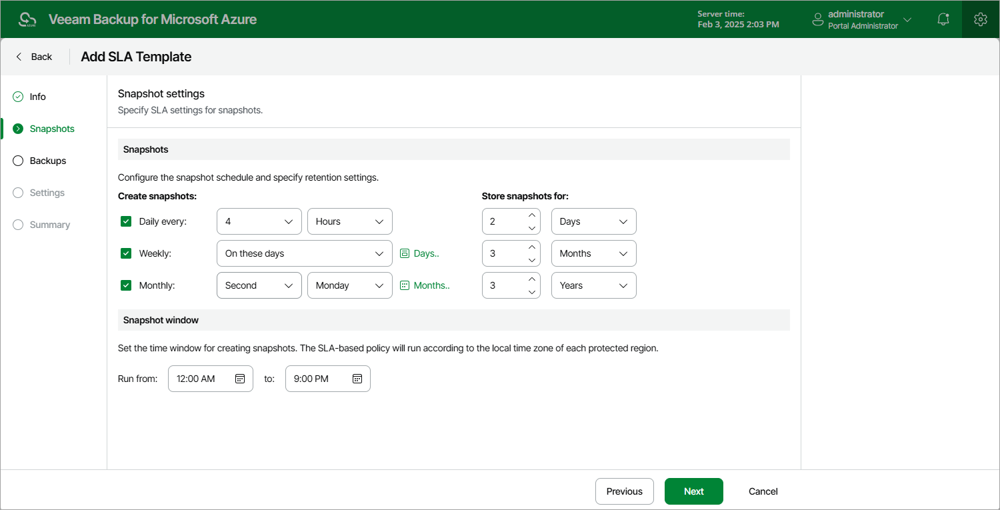

In this article

At the Snapshots step of the wizard, you can configure the following snapshot settings:

1. In the Snapshots section, you can instruct Veeam Backup for Microsoft Azure to create cloud-native snapshots on a daily, weekly and monthly basis, and to keep the created snapshots in a snapshot chain for a specific number of days, months or years. If a snapshot is older than the specified time limit, Veeam Backup for Microsoft Azure removes the snapshot from the chain.

Note that if you configure a schedule but do not select the corresponding check box, Veeam Backup for Microsoft Azure will ignore the specified settings and will not create snapshots according to this schedule.

1. In the Snapshot window section, you can instruct Veeam Backup for Microsoft Azure to create daily snapshots within a specific time interval if you do not want backup operations to overlap production hours.

Veeam Backup for Microsoft Azure automatically adjusts the specified snapshot window to the time zone of each region added to all SLA-based backup policies that have this SLA template assigned. For more information, see [Data Protection Windows](snapshot_backup_window.md).

When you combine multiple types of snapshot schedules, Veeam Backup for Microsoft Azure re-uses snapshots created according to a more-frequent schedule (daily or weekly) to achieve the desired SLA compliance for less-frequent schedules (weekly and monthly). For example, if you configure a daily and a monthly schedule, the first snapshot successfully created according to the daily schedule will be marked as both a daily and a monthly snapshot.

Page updated 3/26/2025

Page content applies to build 8.0.1.202
