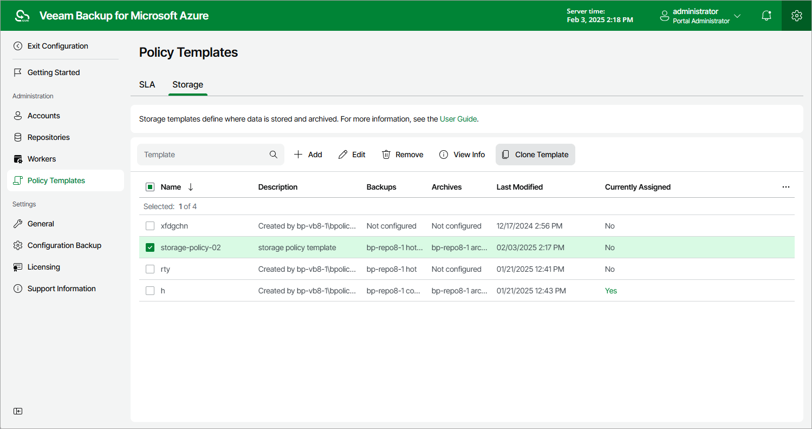

In this article

Veeam Backup for Microsoft Azure allows you to create a new policy template based on the settings of an existing one:

1. Switch to the Configuration page.
2. Navigate to Policy Templates.
3. Switch to the necessary tab and select the template.
4. Click Clone.
5. Complete the Clone SLA Template or the Clone Storage Template wizard as described in section [Adding SLA Templates](sla_add.md) or [Adding Storage Templates](storage_add.md).

Page updated 3/25/2025

Page content applies to build 8.0.1.202
