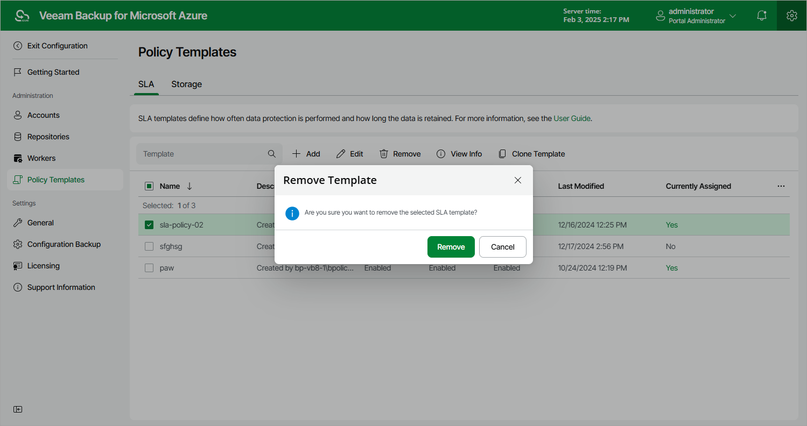

# Removing SLA and Storage Templates

Veeam Backup for Microsoft Azure allows you to permanently remove a policy template from the configuration database if you no longer need it:

1. Switch to the Configuration page.
2. Navigate to Policy Templates.
3. Switch to the necessary tab and select the template.
4. Click Remove.

|  |
| --- |
| Important |
| You cannot remove a template that is used by any SLA-based backup policy. [Modify the settings of all the related policies](backup.md) to remove references to the template — and then try removing the template again. |

