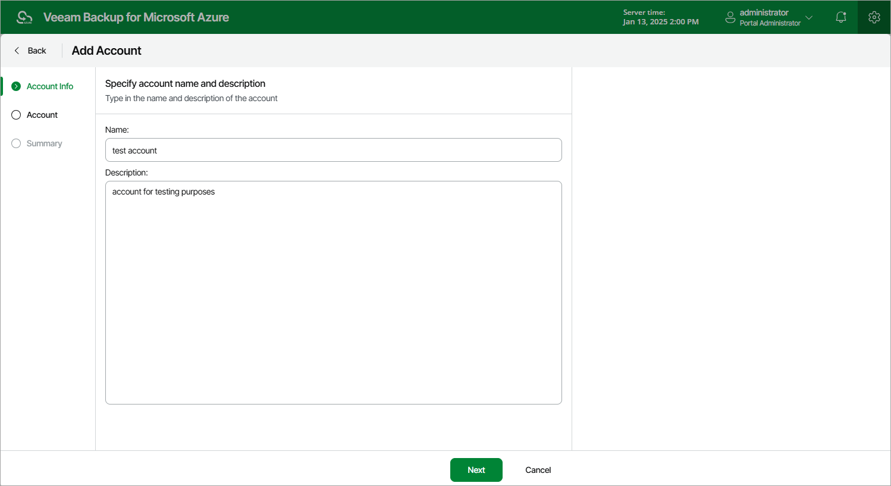

# Step 2. Specify Account Name and Description

At the Account Info step of the wizard, use the Name and Description fields to enter a name for the new account and to provide a description for future reference.

The maximum length of the account name is 32 characters. The following characters are supported: Latin letters, numeric characters, underscores and dashes. The following characters are not supported: \ / " ' ^ [ ] : | < > + = ; , ? ! % \* & $.

