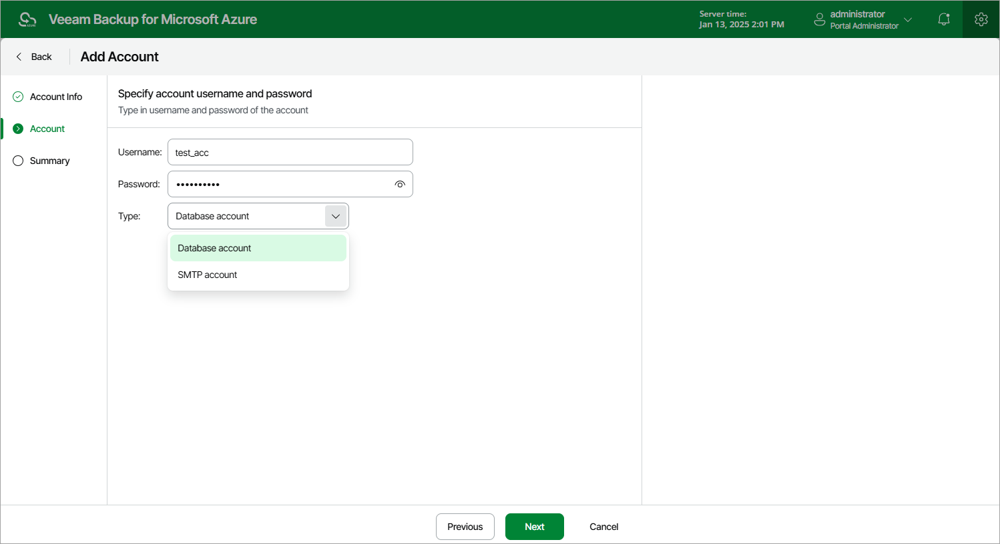

# Step 3. Specify General Settings

At the Account step of the wizard, choose whether the account will be used to connect to SMTP servers or Azure databases, and specify credentials of a user account that will be used to authenticate against the servers or databases.

|  |
| --- |
| Important |
| If you select the Database account option, consider the following:   * The specified credentials must belong to a user account that has the following roles assigned:  * [Applies to SQL Server user accounts] The ##MS\_DatabaseManager##, ##MS\_LoginManager##, ##MS\_ DatabaseConnector## and ##MS\_DefinitionReader## server-level roles, and the db\_owner database-level role. For more information on [server-level roles](https://learn.microsoft.com/en-us/sql/relational-databases/security/authentication-access/server-level-roles?view=sql-server-ver16) and [database-level roles](https://learn.microsoft.com/en-us/sql/relational-databases/security/authentication-access/database-level-roles?view=sql-server-ver16), see Microsoft Docs. * [Applies to Cosmos DB for PostgreSQL user accounts] Any role that has administrative permissions; it is recommended that you use an account that has the built-in citus role assigned. For more information on native PostgreSQL roles, see [Microsoft Docs](https://learn.microsoft.com/en-us/azure/cosmos-db/postgresql/how-to-configure-authentication?tabs=portal).  * Microsoft Entra ID authentication is not supported. |

