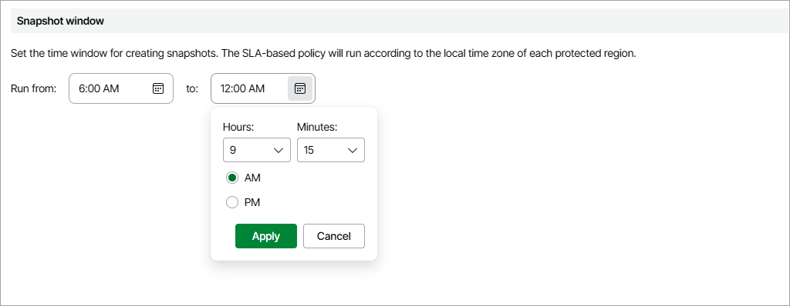

In this article

A data protection window is a time interval during which SLA-based backup policies are allowed to create restore points of protected resources. Data protection windows can be helpful if you do not want SLA-based backup policies to produce unwanted overhead for the production environment or do not want the policies to overlap production hours.

When you specify a data protection window for an SLA-based backup policy, Veeam Backup for Microsoft Azure adjusts this window to the time zone of each Azure region added to the policy. For example, if you instruct Veeam Backup for Microsoft Azure to create daily snapshots of Azure VMs residing in the Central US and North Europe regions between 9:00 AM and 9:00 PM, Veeam Backup for Microsoft Azure will create cloud-native snapshots in the following way:

1. At 9:00 AM North European time (9:00 UTC), Veeam Backup for Microsoft Azure will start creating the first daily snapshot in the North Europe region.
2. At 9:00 AM Central US time (15:00 UTC), Veeam Backup for Microsoft Azure will start creating the first daily snapshot in the Central US region.

|  |
| --- |
| Note |
| If a running SLA-based backup policy exceeds the allowed data protection window, Veeam Backup for Microsoft Azure will not stop the policy immediately and will continue creating restore points. |

Keep in mind that the value that you specify as the end of a data protection window is excluded from this window. For example, if you instruct Veeam Backup for Microsoft Azure to create daily snapshots every hour between 10:00 AM and 1:00 PM, Veeam Backup for Microsoft Azure will create 3 snapshots over this interval: at 10:00 AM, 11:00 AM and 12:00 PM. However, if you instruct Veeam Backup for Microsoft Azure to create daily snapshots every hour between 10:00 AM and 1:05 PM, Veeam Backup for Microsoft Azure will create 4 snapshots: at 10:00 AM, 11:00 AM, 12:00 PM and 1:00 PM.

Related Topics

[Adding SLA Templates](sla_add.md)

Page updated 1/13/2026

Page content applies to build 8.0.1.202
