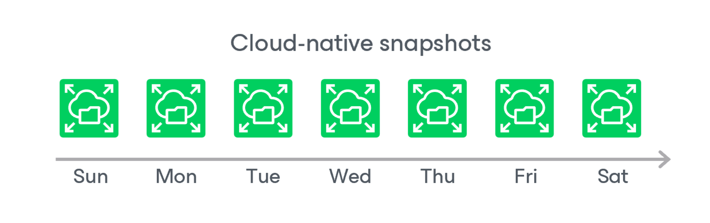

# Snapshot Chain

During every backup session, Veeam Backup for Microsoft Azure creates a cloud-native snapshot of each Azure file share added to a backup policy. The cloud-native snapshot itself is a collection of point-in-time snapshots of share files that Veeam Backup for Microsoft Azure takes using [native Microsoft Azure capabilities](https://docs.microsoft.com/en-us/azure/storage/files/storage-snapshots-files).

A sequence of cloud-native snapshots created during a set of backup sessions makes up a snapshot chain. Veeam Backup for Microsoft Azure creates the snapshot chain in the following way:

1. During the first backup session, Veeam Backup for Microsoft Azure creates a snapshot of all Azure Files data and saves it on the processed file share. This snapshot becomes a starting point in the snapshot chain.
2. During subsequent backup sessions, Veeam Backup for Microsoft Azure creates snapshots with only those files and directories that have changed since the previous backup session.

For more information on how snapshots work, see [Microsoft Docs](https://docs.microsoft.com/en-us/azure/storage/files/storage-snapshots-files).

Each cloud-native snapshot in the snapshot chain contains metadata. Metadata includes information about the processed file share, the backup policy that created the snapshot, and a number of snapshots in the chain. Veeam Backup for Microsoft Azure uses metadata to identify outdated snapshots, to load the configuration of source file shares during recovery operations, and so on.

Cloud-native snapshots act as independent restore points for backed-up file shares. If you remove any snapshot, it will not break the snapshot chain — you will still be able to roll back your data to any existing restore point.

The number of cloud-native snapshots kept in the snapshot chain is defined by retention policy settings. For more information, see [File Share Snapshot Retention](file_share_snapshot_retention.md).

