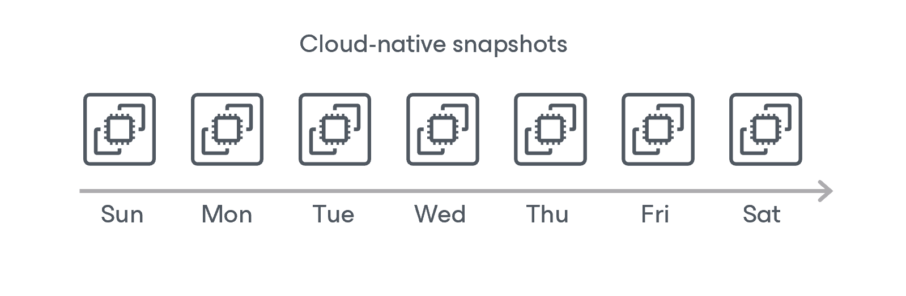

# Snapshot Chain

During every backup session, Veeam Backup for Microsoft Azure creates a cloud-native snapshot of each Azure VM added to a backup policy. The cloud-native snapshot itself is a collection of point-in-time snapshots of virtual disks that Veeam Backup for Microsoft Azure creates using native Microsoft Azure capabilities.

A sequence of cloud-native snapshots created during a set of backup sessions makes up a snapshot chain. Veeam Backup for Microsoft Azure builds the snapshot chain in the following way:

1. During the first backup session, Veeam Backup for Microsoft Azure creates a snapshot of all Azure VM data and saves it in a standard HDD storage. This snapshot becomes a starting point in the snapshot chain.
2. During subsequent backup sessions, Veeam Backup for Microsoft Azure creates snapshots with only those data blocks that have changed since the previous backup session.

The size of each snapshot depends on the total used size of all virtual disks attached to the processed Azure VM. For more information on how incremental Azure VM snapshots work, see [Microsoft Docs](https://docs.microsoft.com/en-us/azure/virtual-machines/disks-incremental-snapshots).

Each cloud-native snapshot in the snapshot chain contains metadata. Metadata includes information about the protected Azure VM, the backup policy that created the snapshot, and the number of snapshots in the chain. Veeam Backup for Microsoft Azure uses metadata to identify outdated snapshots, to load the configuration of source Azure VMs during recovery operations, and so on.

Cloud-native snapshots act as independent restore points for backed-up Azure VMs. If you remove any snapshot, it will not break the snapshot chain — you will still be able to roll back your data to any existing restore point.

The number of cloud-native snapshots kept in the snapshot chain (and the period during which these snapshots are kept) is defined by retention policy settings. For more information, see [VM Snapshot Retention](vm_snapshot_retention.md).

